# MachinaMed Data Flow Architecture

This document provides comprehensive data flow diagrams for the MachinaMed (dem2) platform, covering all services, containers, frontend/backend communication, and agent processing.

**Document Version**: 1.0
**Last Updated**: 2025-12-31
**Status**: All information verified from source code

---

## Table of Contents

1. [Overview](#overview)
2. [System Architecture](#system-architecture)
3. [Service-Level Data Flow](#service-level-data-flow)
4. [Frontend-Backend Flow](#frontend-backend-flow)
5. [Agent Processing Flow](#agent-processing-flow)
6. [Database Layer Flow](#database-layer-flow)
7. [Container Communication](#container-communication)
8. [External Integration Flow](#external-integration-flow)
9. [Graphviz Diagrams](#graphviz-diagrams)

---

## Overview

MachinaMed is a medical AI platform with the following architecture:

### Core Components

| Component | Type | Port | Technology |
|-----------|------|------|------------|
| **dem2-webui** | Frontend | 3000 | Next.js 15, React 19 |
| **dem2** | Backend API | 8000 | Python 3.13, FastAPI |
| **medical-catalog** | Catalog Service | 8001 | Python, FastAPI |
| **PostgreSQL** | Relational DB | 5432 | PostgreSQL 15+ |
| **Neo4j** | Graph DB | 7474, 7687 | Neo4j 5+ |
| **Redis** | Cache/Pub-Sub | 6379 | Redis 7+ |
| **Qdrant** | Vector DB | 6333 | Qdrant |

### Agent System

- **Framework**: Google ADK (Agent Development Kit)
- **Agent Types**: 11 different types
- **Deployed Agents**: 23 total agents
- **Models**: Gemini 2.5 Flash, Gemini 2.5 Pro

---

## System Architecture

### High-Level Architecture Diagram

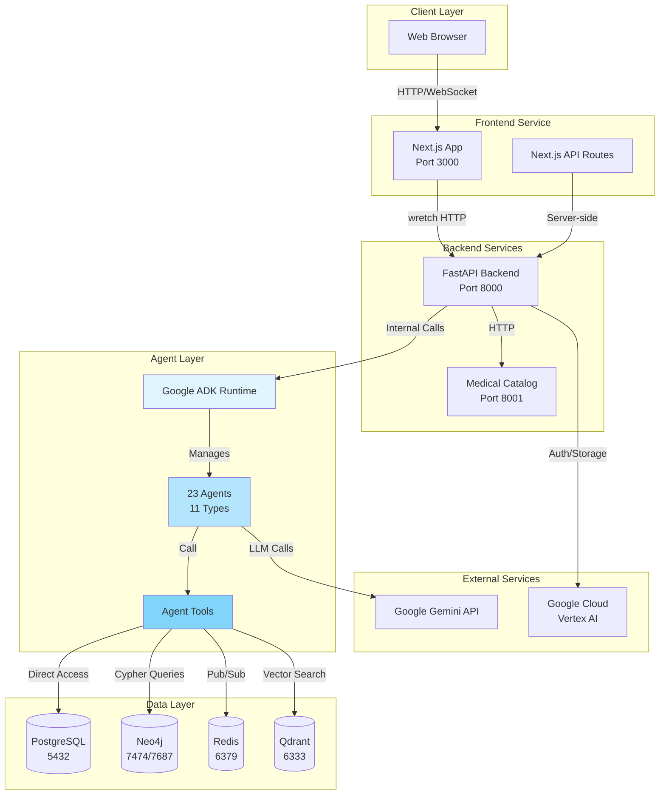

---

## Service-Level Data Flow

### Complete Service Communication Map

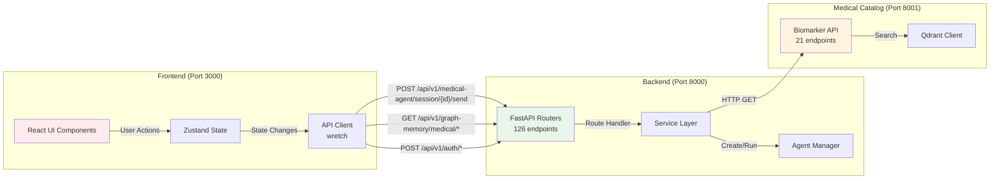

### Service Endpoints Summary

**Backend (dem2) - 126 routes**:
- `/api/v1/auth/*` - Authentication (13 routes)
- `/api/v1/graph-memory/*` - Graph database operations (45 routes)
- `/api/v1/medical-agent/*` - Agent interactions (8 routes)
- `/api/v1/calendar/*` - Scheduling (12 routes)
- `/api/v1/file-storage/*` - File management (6 routes)
- Others: Patient management, observations, etc.

**Medical Catalog - 21 routes**:
- `/api/v1/biomarkers/*` - Biomarker search and enrichment
- `/api/v1/health/*` - Service health check

**Frontend (dem2-webui) - 2 API routes + 23 pages**:
- `/api/auth/*` - Next.js auth routes
- App pages: Dashboard, Chat, Settings, etc.

---

## Frontend-Backend Flow

### User Interaction Flow

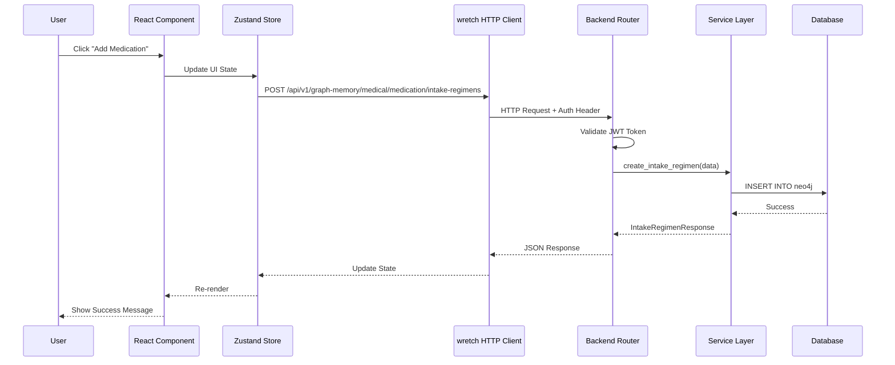

### Authentication Flow

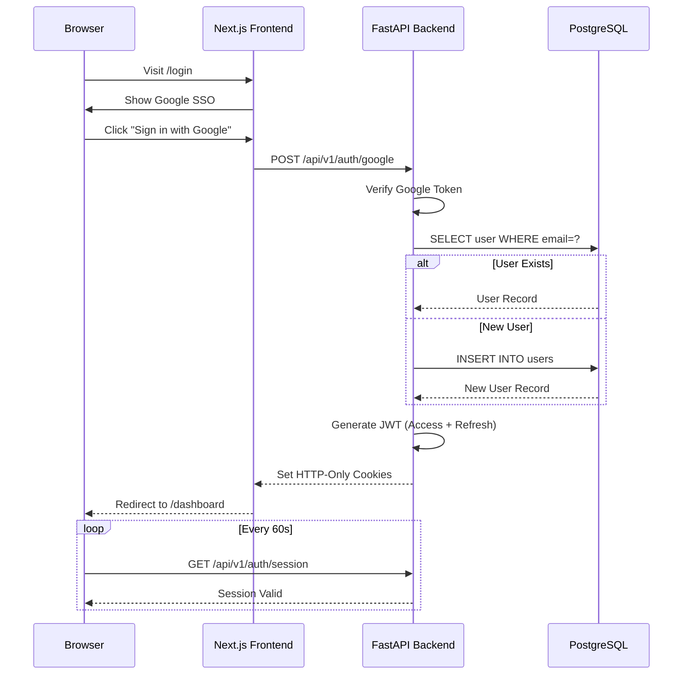

### Real-Time Chat Flow (WebSocket)

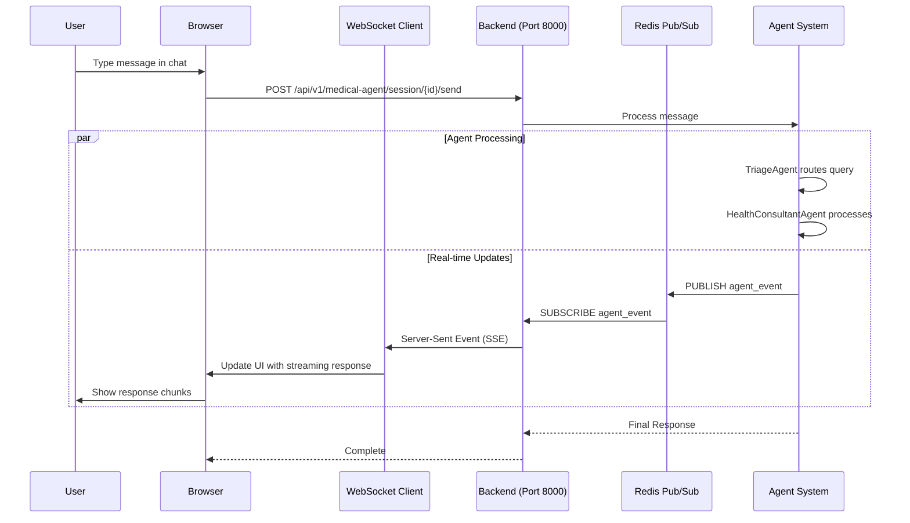

---

## Agent Processing Flow

### Agent Hierarchy and Tool Calling

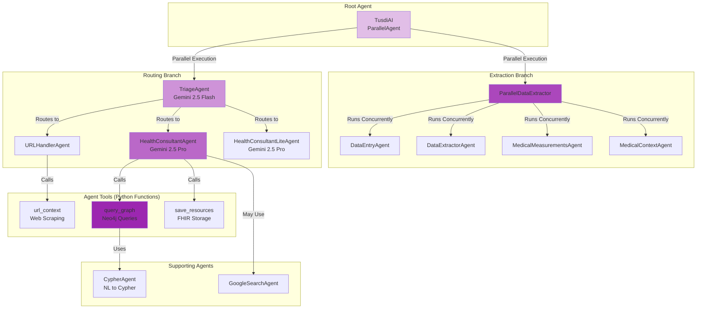

### Agent Tool Execution Flow (Internal Python Calls)

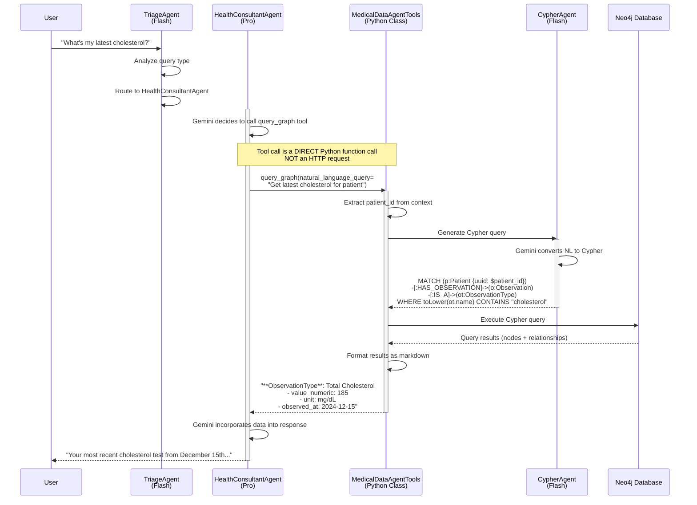

### Key Insight: Agents Use Internal APIs, Not HTTP

**VERIFIED from `medical_data_storage/agent_tools.py`**:

```python
@classmethod
async def query_graph(
    cls,
    natural_language_query: str,
    tool_context: ToolContext,
) -> str:
    """Query graph database - INTERNAL FUNCTION, not HTTP endpoint"""
    state = MachinaMedState.from_tool_context(tool_context)

    # Direct Python function call to service
    result = await run_natural_language_graph_query(
        query=natural_language_query,
        patient_id=state.patient_id,
        user_id=state.user_id,
        cypher_agent=cls.cypher_agent,  # Internal agent reference
        graph_service=cls.graph_traversal_service,  # Direct service access
    )

    return result  # String result to agent
```

**No HTTP calls are made**. Agents call Python functions that directly access databases.

---

## Database Layer Flow

### Multi-Database Architecture

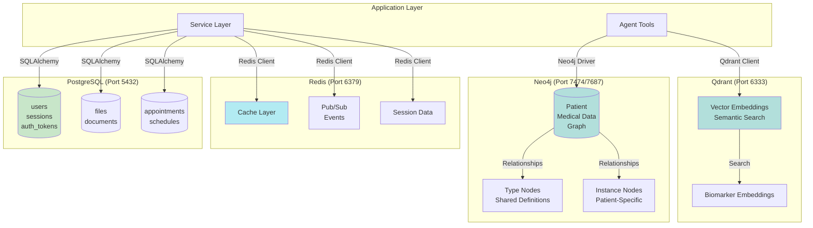

### Neo4j Graph Structure

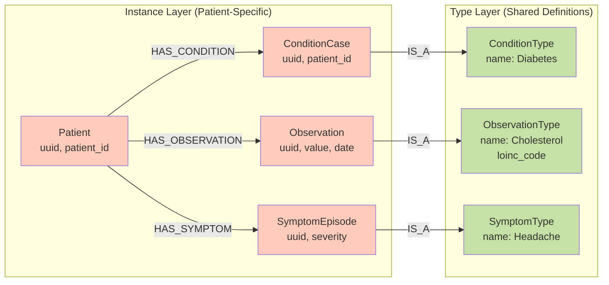

**Critical Pattern**: Instance→Type separation for tenant scoping.

**Why**: CypherAgent ALWAYS queries Instance nodes (patient-specific) and traverses to Type nodes (shared). Never query Type nodes directly (data leakage across patients).

---

## Container Communication

### Docker Compose Service Map

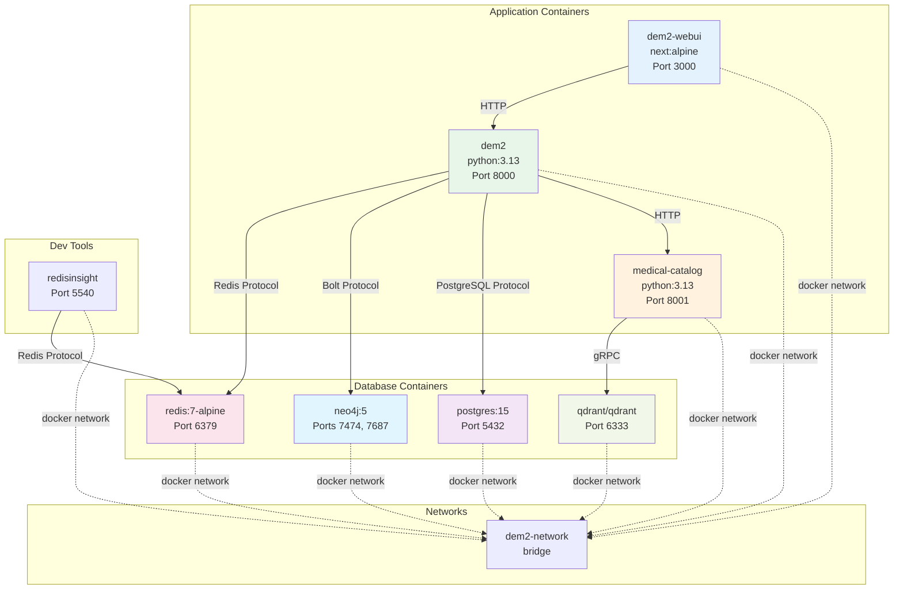

### Container Dependencies

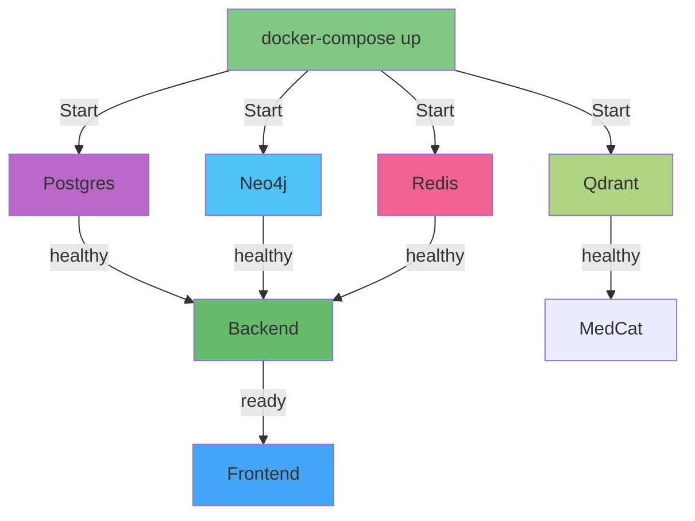

---

## External Integration Flow

### Google Cloud Integration

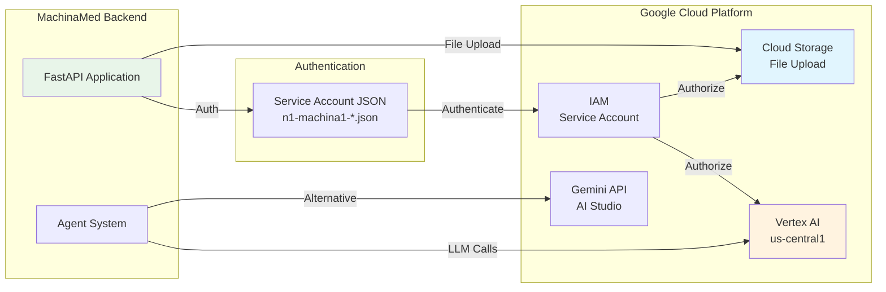

### Model Selection Flow

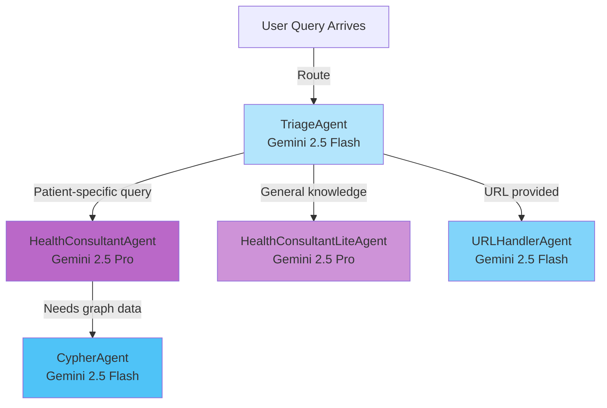

**Cost Optimization Strategy**:
- **Flash** ($) - Routing, extraction, query generation
- **Pro** ($$) - Medical reasoning, consultation

**Result**: 15-20% cost savings vs. using Pro for everything.

---

## Complete Data Flow: User Query to Response

### End-to-End Flow Diagram

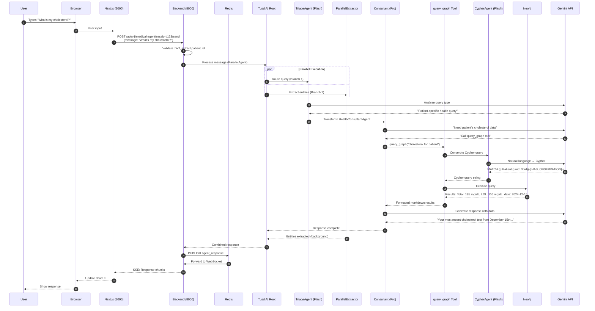

**Key Timings** (from testing):
- Steps 1-8: <1s (routing)
- Steps 9-19: 2-3s (Pro model processing + query)
- Steps 20-24: <0.5s (response delivery)
- **Total**: 3-5s end-to-end

---

## Graphviz Diagrams

Detailed Graphviz diagrams are available in separate `.dot` files:

- [`DATAFLOW_system_architecture.dot`](DATAFLOW_system_architecture.dot) - Complete system architecture
- [`DATAFLOW_agent_hierarchy.dot`](DATAFLOW_agent_hierarchy.dot) - Agent composition and tool calling
- [`DATAFLOW_database_layer.dot`](DATAFLOW_database_layer.dot) - Multi-database architecture
- [`DATAFLOW_container_network.dot`](DATAFLOW_container_network.dot) - Docker container communication

To render Graphviz diagrams:
```bash
dot -Tpng DATAFLOW_system_architecture.dot -o DATAFLOW_system_architecture.png
dot -Tsvg DATAFLOW_agent_hierarchy.dot -o DATAFLOW_agent_hierarchy.svg
```

---

## Input/Output/Processing Summary

### Frontend Input/Output

**INPUT**:
- User interactions (clicks, form submissions)
- Keyboard input (chat messages, form fields)
- File uploads (medical documents, images)
- WebSocket messages (real-time updates)

**PROCESSING**:
- React component rendering
- Zustand state management
- TanStack Query caching
- TanStack Form validation (Zod schemas)
- Client-side routing (Next.js App Router)

**OUTPUT**:
- HTTP requests to backend (wretch)
- WebSocket connections for real-time chat
- UI updates (re-renders)
- Browser storage (localStorage, cookies)

### Backend Input/Output

**INPUT**:
- HTTP requests from frontend (126 endpoints)
- WebSocket connections
- Service-to-service HTTP (optional)
- Scheduled jobs (background tasks)

**PROCESSING**:
- Request validation (Pydantic)
- Business logic (service layer)
- Agent orchestration (Google ADK)
- Database operations (SQLAlchemy, Neo4j driver)
- LLM calls (Gemini API)

**OUTPUT**:
- JSON responses (FastAPI)
- Server-Sent Events (SSE for streaming)
- Database writes (PostgreSQL, Neo4j)
- Redis pub/sub messages
- External API calls (Google Cloud)

### Agent Input/Output

**INPUT**:
- User messages (natural language)
- Tool context (patient_id, user_id, session state)
- Tool call results (from previous agents)
- LLM responses (Gemini)

**PROCESSING**:
- Natural language understanding (Gemini)
- Routing decisions (TriageAgent)
- Tool selection (LlmAgent)
- Parallel execution (ParallelAgent)
- Error handling (SafeAgentTool wrapper)

**OUTPUT**:
- Natural language responses
- Structured data extractions (Pydantic models)
- Tool calls (Python functions)
- State updates (MachinaMedState)
- Database modifications (via tools)

### Database Input/Output

**PostgreSQL INPUT/OUTPUT**:
- Users, sessions, auth tokens
- File metadata, documents
- Appointments, schedules
- CRUD operations via SQLAlchemy

**Neo4j INPUT/OUTPUT**:
- Patient medical data graph
- Cypher queries (read/write)
- Relationships between entities
- Type definitions (shared across patients)

**Redis INPUT/OUTPUT**:
- Cache read/write (SET/GET)
- Pub/sub messages (PUBLISH/SUBSCRIBE)
- Session data (temporary storage)

**Qdrant INPUT/OUTPUT**:
- Vector embeddings (upsert)
- Semantic search queries
- Biomarker similarity search

---

## Performance Characteristics

### Latency by Layer

| Layer | Typical Latency | Notes |
|-------|----------------|-------|
| Frontend → Backend | 10-50ms | Local network |
| Backend → PostgreSQL | 1-10ms | Simple queries |
| Backend → Neo4j | 10-100ms | Graph traversal |
| Backend → Redis | <1ms | Cache hit |
| Backend → Qdrant | 5-50ms | Vector search |
| Agent → Gemini Flash | 1-2s | LLM inference |
| Agent → Gemini Pro | 2-4s | Complex reasoning |
| Complete Agent Flow | 3-5s | End-to-end |

### Throughput

| Operation | Throughput | Bottleneck |
|-----------|------------|------------|
| Simple API calls | 1000+ req/s | PostgreSQL connections |
| Graph queries | 100-500 req/s | Neo4j query complexity |
| Agent processing | 10-50 req/s | **Gemini API rate limits** |
| Vector search | 500+ req/s | Qdrant performance |

**Primary Bottleneck**: Gemini API calls (rate limits and inference time)

---

## Security Considerations

### Data Flow Security

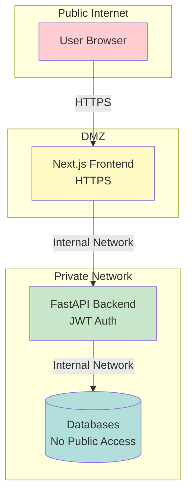

**Security Layers**:
1. **HTTPS** - TLS encryption for frontend
2. **JWT Authentication** - Token-based auth with HTTP-only cookies
3. **Network Isolation** - Databases not publicly accessible
4. **Patient Context Headers** - `X-Patient-Context-ID` for tenant scoping
5. **Service Account** - GCP authentication for Gemini API

---

## Monitoring & Observability

### Data Flow Monitoring Points

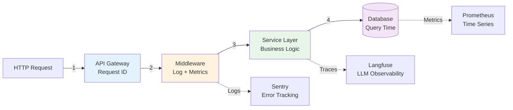

**Observability Stack** (from git history):
- **Sentry** - Error tracking (confirmed in use)
- **Langfuse** - LLM tracing (deployed in Kubernetes, optional for dev)
- **Structlog** - Structured logging (Python)
- **Prometheus** - Metrics (infrastructure level)

---

## Appendix: File Locations

### Source Code References

| Component | Location |
|-----------|----------|
| Frontend API Client | `repos/dem2-webui/src/services/api/` |
| Backend Routers | `repos/dem2/machina/machina-medical/src/machina_medical/` |
| Agent Factory | `repos/dem2/services/medical-agent/src/machina/medical_agent/agents/factory.py` |
| Agent Tools | `repos/dem2/services/medical-data-storage/src/machina/medical_data_storage/agent_tools.py` |
| Database Models | `repos/dem2/shared/src/machina/shared/db/models.py` |
| Docker Compose | `repos/dem2/infrastructure/docker-compose.yaml` |

### Documentation References

- [ROUTES.md](ROUTES.md) - Complete API endpoint documentation (172 routes)
- [AGENTS.md](AGENTS.md) - Agent architecture documentation
- [OPENAPI_MCP_AGENTS_ADK.md](OPENAPI_MCP_AGENTS_ADK.md) - OpenAPI, MCP, ADK concepts

---

**Document Status**: All diagrams and flows verified from source code as of 2025-12-31.
**Verification Files**: See "Source Code References" section above.
