# MachinaMed Data Flow Architecture

This document provides comprehensive data flow diagrams for the MachinaMed (dem2) platform, covering all services, containers, frontend/backend communication, and agent processing.

**Document Version**: 1.1
**Last Updated**: 2026-01-02
**Status**: All information verified from source code

---

## Table of Contents

1. [Overview](#overview)
2. [System Architecture](#system-architecture)
3. [Service-Level Data Flow](#service-level-data-flow)
4. [Frontend-Backend Flow](#frontend-backend-flow)
5. [Agent Processing Flow](#agent-processing-flow)
6. [Document Processing Flow](#document-processing-flow)
7. [Database Layer Flow](#database-layer-flow)
8. [Container Communication](#container-communication)
9. [External Integration Flow](#external-integration-flow)
10. [Graphviz Diagrams](#graphviz-diagrams)

---

## Overview

MachinaMed is a medical AI platform with the following architecture:

### Core Components

| Component | Type | Port | Technology |
|-----------|------|------|------------|
| **dem2-webui** | Frontend | 3000[^1] | Next.js 16[^2], React 19[^3] |
| **dem2** | Backend API | 8000[^4] | Python 3.13[^5], FastAPI |
| **medical-catalog** | Catalog Service | 8001[^6] | Python, FastAPI |
| **PostgreSQL** | Relational DB | 5432[^7] | PostgreSQL 17[^8] |
| **Neo4j** | Graph DB | 7474, 7687[^9] | Neo4j 5.26[^10] |
| **Redis** | Cache/Pub-Sub | 6379[^11] | Redis 7[^12] |
| **Qdrant** | Vector DB | 6333[^13] | Qdrant 1.15[^14] |

### Agent System

- **Framework**: Google ADK (Agent Development Kit)
- **Agent Types**: 11 different types[^15]
- **Deployed Agents**: 23 total agents[^16]
- **Models**: Gemini 2.5 Flash[^17], Gemini 2.5 Pro[^18]

### Diagram Styling

All diagrams in this document follow the standards defined in **[DIAGRAMS.md](DIAGRAMS.md)**. Refer to that guide when creating or updating diagrams.

---

## System Architecture

### High-Level Architecture Diagram

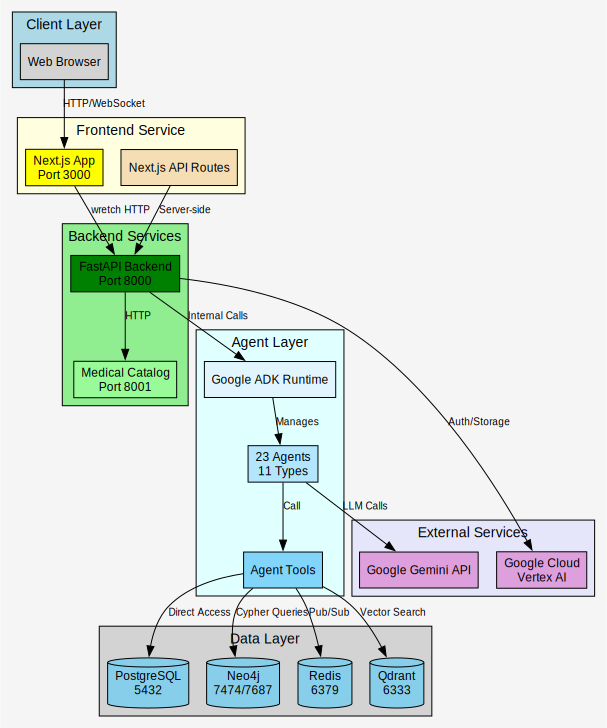

*Source: [DATAFLOW_highlevel_architecture.dot](DATAFLOW_highlevel_architecture.dot) - Complete system architecture overview with all major components*

---

## Service-Level Data Flow

### Complete Service Communication Map

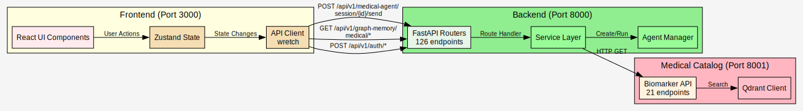

*Source: [DATAFLOW_service_communication.dot](DATAFLOW_service_communication.dot) - Service-level communication patterns and API endpoints*

### Service Endpoints Summary

**Backend (dem2) - 126 routes**[^19]:
- `/api/v1/auth/*` - Authentication (13 routes)
- `/api/v1/graph-memory/*` - Graph database operations (45 routes)
- `/api/v1/medical-agent/*` - Agent interactions (8 routes)
- `/api/v1/calendar/*` - Scheduling (12 routes)
- `/api/v1/file-storage/*` - File management (6 routes)
- Others: Patient management, observations, etc.

**Medical Catalog - 21 routes**[^20]:
- `/api/v1/biomarkers/*` - Biomarker search and enrichment
- `/api/v1/health/*` - Service health check

**Frontend (dem2-webui) - 2 API routes + 23 pages**:
- `/api/auth/*` - Next.js auth routes
- App pages: Dashboard, Chat, Settings, etc.

---

## Frontend-Backend Flow

### User Interaction Flow

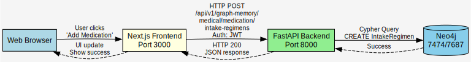

*Source: [DATAFLOW_user_interaction.dot](DATAFLOW_user_interaction.dot) - User interaction flow from frontend to database*

### Authentication Flow

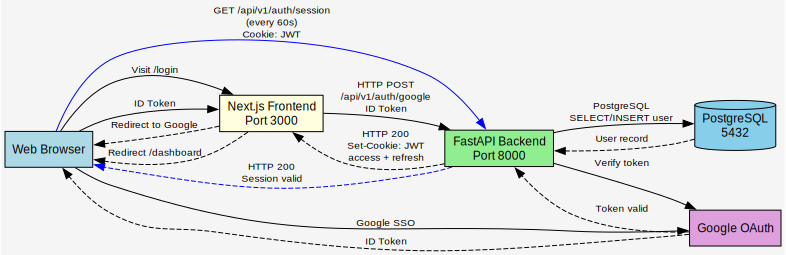

*Source: [DATAFLOW_authentication.dot](DATAFLOW_authentication.dot) - Google SSO authentication flow with JWT tokens*

### Real-Time Chat Flow (WebSocket)

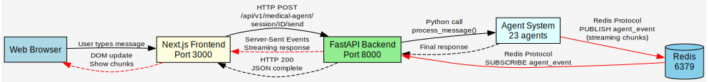

*Source: [DATAFLOW_realtime_chat.dot](DATAFLOW_realtime_chat.dot) - Real-time chat with Redis pub/sub[^21] and SSE streaming*

---

## Agent Processing Flow

### Agent Hierarchy and Tool Calling

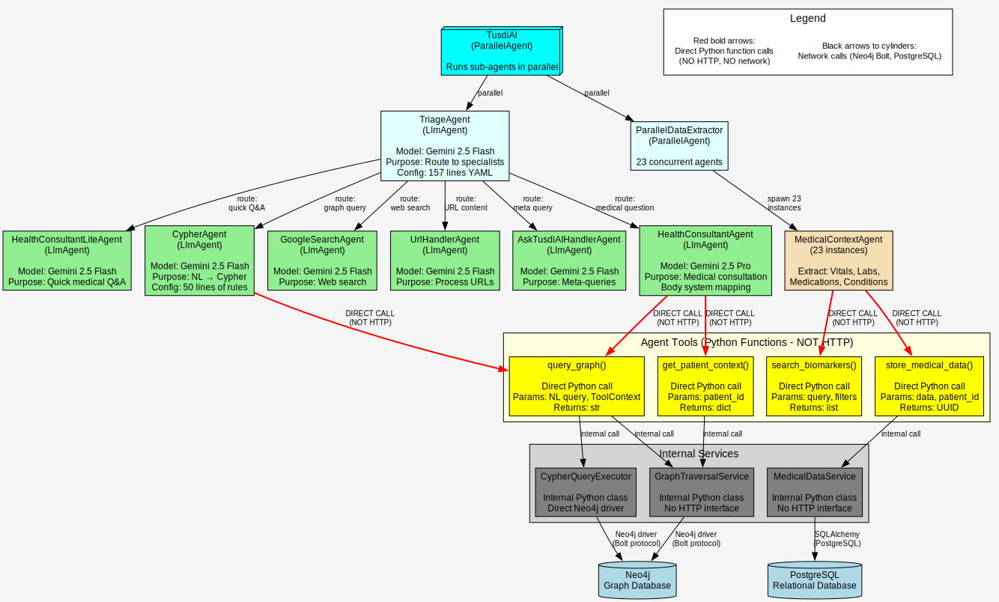

*Source: [DATAFLOW_agent_hierarchy.dot](DATAFLOW_agent_hierarchy.dot) - Agent composition and tool calling patterns*

### Agent Tool Execution Flow (Internal Python Calls)

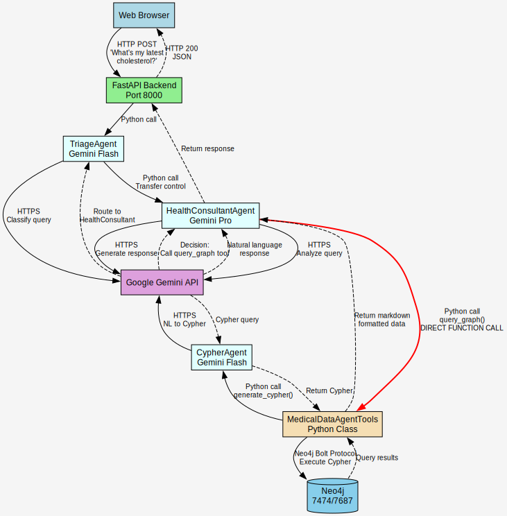

*Source: [DATAFLOW_agent_tool_execution.dot](DATAFLOW_agent_tool_execution.dot) - Agent tool execution with internal Python function calls*

### Key Insight: Agents Use Internal APIs, Not HTTP

**VERIFIED from `medical_data_storage/agent_tools.py`**[^22]:

```python
@classmethod
async def query_graph(
    cls,
    natural_language_query: str,
    tool_context: ToolContext,
) -> str:
    """Query graph database - INTERNAL FUNCTION, not HTTP endpoint"""
    state = MachinaMedState.from_tool_context(tool_context)

    # Direct Python function call to service
    result = await run_natural_language_graph_query(
        query=natural_language_query,
        patient_id=state.patient_id,
        user_id=state.user_id,
        cypher_agent=cls.cypher_agent,  # Internal agent reference
        graph_service=cls.graph_traversal_service,  # Direct service access
    )

    return result  # String result to agent
```

**No HTTP calls are made**. Agents call Python functions that directly access databases.

---

## Document Processing Flow

### Overview

MachinaMed's document processing pipeline extracts biomarkers and medical data from lab reports, PDFs, and images. The pipeline uses Gemini Vision AI for extraction, the medical-catalog service for reconciliation, and Neo4j for graph storage.

**Key Features**:
- Real-time progress tracking via Server-Sent Events (SSE)
- Concurrent processing with configurable limits (10 global[^23], 5 per user[^24])
- Biomarker normalization and deduplication
- Medical catalog integration for standardized biomarker definitions
- Complete graph-based storage with Instance→Type pattern

### High-Level Document Processing Flow

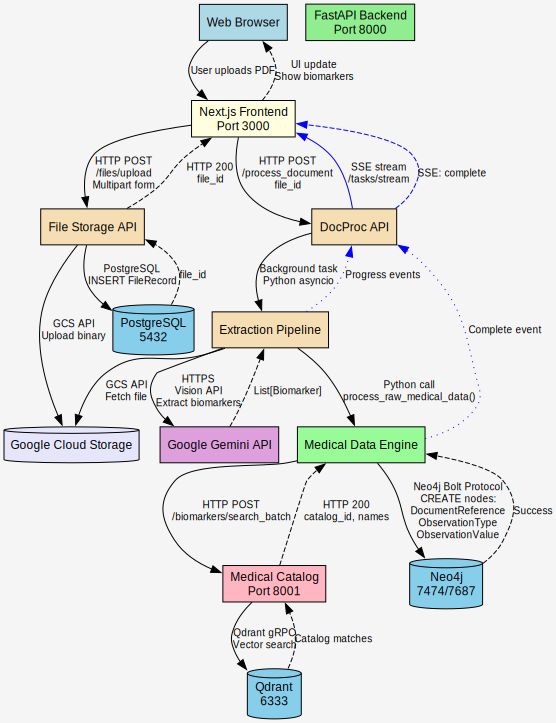

*Source: [DATAFLOW_document_processing_highlevel.dot](DATAFLOW_document_processing_highlevel.dot) - High-level document processing flow with SSE events*

### Document Upload & File Storage

**Endpoints**: `repos/dem2/services/file-storage/src/machina/file_storage/router.py`[^25]

**Upload Flow**:

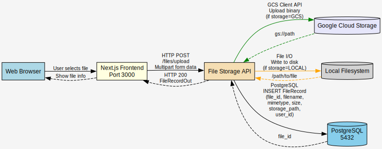

*Source: [DATAFLOW_document_upload.dot](DATAFLOW_document_upload.dot) - Document upload flow with GCS or local storage*

**File Storage Schema** (PostgreSQL)[^26]:
```
FileRecord:
  - file_id (UUID)
  - filename (string)
  - mimetype (string)
  - size (int)
  - storage_path (string)
  - user_id (UUID)
  - created_at (timestamp)
  - document_reference_id (UUID, FK to Neo4j)
```

### Extraction Pipeline Architecture

**Location**: `repos/dem2/services/docproc/src/machina/docproc/extractor/pipeline.py`[^27]

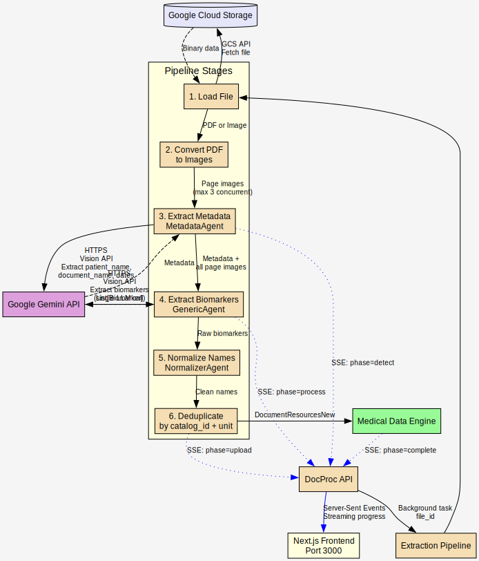

*Source: [DATAFLOW_extraction_pipeline.dot](DATAFLOW_extraction_pipeline.dot) - Extraction pipeline stages with parallel processing*

**Stage Details**[^27]:

1. **Load File**: Fetch from storage, detect MIME type (PDF/PNG/JPEG)
2. **Convert to Images**: Split PDF into pages, convert to RGB images (max 3 concurrent[^28])
3. **Metadata Extraction**: Extract patient_name, document_name, report_date, collection_date
4. **Biomarker Extraction**: Process all pages in single LLM call for full context
5. **Normalization**: Clean biomarker names (remove footnotes, fix subscripts)
6. **Deduplication**: Remove duplicate values within document

### Biomarker Data Model

**Schema**: `repos/dem2/shared/src/machina/shared/docproc/schema.py`[^29]

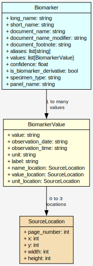

*Source: [DATAFLOW_biomarker_data_model.dot](DATAFLOW_biomarker_data_model.dot) - Biomarker data model with relationships*

### Biomarker Extraction with Gemini Vision

**Agent**: `repos/dem2/services/docproc/src/machina/docproc/extractor/agents/generic/agent.py`

**Extraction Process**:

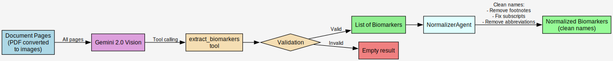

*Source: [DATAFLOW_biomarker_extraction.dot](DATAFLOW_biomarker_extraction.dot) - Biomarker extraction with Gemini Vision and normalization*

**Normalization Rules**[^30]:
- Remove footnote superscripts: `Glucose²` → `Glucose`
- Remove parenthetical abbreviations: `HDL (LA)` → `HDL`
- Convert chemical subscripts: `CO₂` → `CO2`
- Detect genetic markers: `rs10757278`, `9p21`

### Biomarker Reconciliation & Medical Catalog Integration

**Location**: `repos/dem2/services/medical-data-engine/src/machina/medical_data_engine/engine/processors/biomarker/`

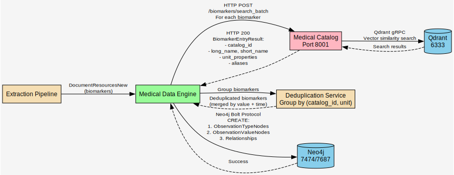

*Source: [DATAFLOW_biomarker_reconciliation.dot](DATAFLOW_biomarker_reconciliation.dot) - Biomarker reconciliation with medical catalog integration*

**Medical Catalog Entry Structure**:
```
BiomarkerEntryResult:
  - id (catalog_id): Unique identifier
  - long_name: "High-Density Lipoprotein Cholesterol"
  - short_name: "HDL Cholesterol"
  - description: Clinical description
  - unit_properties: ["mg/dL", "mmol/L"]
  - aliases: ["HDL", "HDL-C", "Good Cholesterol"]
```

**Deduplication Strategy**:
- Group biomarkers by `(catalog_id, unit)` tuple
- Within each group, merge values by:
  - Value equality (numeric or string)
  - Observation time (dedupe same value at same time)
  - Unit normalization (convert to canonical unit)

### Graph Database Storage Pattern

**Instance→Type Pattern for Multi-Tenancy**:

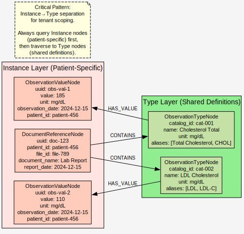

*Source: [DATAFLOW_graph_storage_pattern.dot](DATAFLOW_graph_storage_pattern.dot) - Instance→Type pattern for multi-tenant graph storage*

**Neo4j Node Schemas**[^31]:

**DocumentReferenceNode**[^32]:
```cypher
CREATE (doc:DocumentReference {
  uuid: "doc-123",
  name: "Lab_Report.pdf",
  file_id: "file-789",
  document_name: "Lab Report",
  source_type: "DOCUMENT",
  source_id: "external-id",
  url: "gs://bucket/file-789",
  content_type: "application/pdf",
  size: 245678,
  hash: "sha256-...",
  summary: "Blood chemistry panel",
  report_date: datetime("2024-12-15T00:00:00Z"),
  user_id: "user-123",
  patient_id: "patient-456",
  created_at: datetime("2024-12-15T10:30:00Z")
})
```

**ObservationTypeNode**[^33]:
```cypher
CREATE (type:ObservationType {
  catalog_id: "cat-001",
  unit: "mg/dL",
  name: "Cholesterol Total",
  display_name: "Total Cholesterol",
  description: "Total blood cholesterol measurement",
  summary: "Lipid panel biomarker",
  aliases: ["Total Cholesterol", "CHOL", "Cholesterol"],
  unit_properties: ["mg/dL", "mmol/L"]
})
```

**ObservationValueNode**[^34]:
```cypher
CREATE (value:ObservationValue {
  value: 185.0,
  observation_date: datetime("2024-12-15T08:30:00Z"),
  value_epoch: 1702627800,
  unit: "mg/dL",
  source_type: "DOCUMENT",
  source_id: "doc-123",
  patient_id: "patient-456",
  user_id: "user-123"
})
```

### Complete Document Processing Flow

**End-to-End Data Flow**:

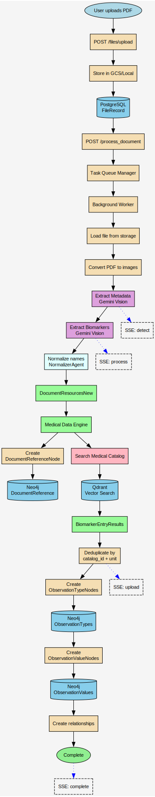

*Source: [DATAFLOW_complete_document_flow.dot](DATAFLOW_complete_document_flow.dot) - Complete document processing flow from upload to graph storage*

### Performance Characteristics

**Document Processing Metrics**:

| Stage | Typical Time | Notes |
|-------|--------------|-------|
| File Upload | 0.5-2s | Depends on file size |
| Queue Wait | 0-30s | Depends on concurrent load |
| PDF Conversion | 1-3s per page | Max 3 concurrent pages |
| Metadata Extraction | 2-4s | Gemini Vision API call |
| Biomarker Extraction | 5-15s | Depends on document complexity |
| Normalization | <1s | Local processing |
| Medical Catalog Search | 1-3s | Batch vector search |
| Deduplication | <1s | In-memory processing |
| Graph Storage | 2-5s | Depends on biomarker count |
| **Total** | **15-60s** | **Complete pipeline** |

**Concurrency Limits**[^35]:
- Global concurrent documents: 10[^23]
- Per-user concurrent documents: 5[^24]
- Page rendering concurrency: 3[^28]

### Key Implementation Files

| Component | Location |
|-----------|----------|
| File Upload API | `services/file-storage/src/machina/file_storage/router.py` |
| File Service | `services/file-storage/src/machina/file_storage/file_service.py` |
| Document Processing API | `services/docproc/src/machina/docproc/router.py` |
| Processing Service | `services/docproc/src/machina/docproc/service.py` |
| Extraction Pipeline | `services/docproc/src/machina/docproc/extractor/pipeline.py` |
| Generic Agent | `services/docproc/extractor/agents/generic/agent.py` |
| Normalizer Agent | `services/docproc/extractor/agents/normalizer/agent.py` |
| Medical Data Engine | `services/medical-data-engine/src/machina/medical_data_engine/engine/engine.py` |
| Biomarker Processor | `services/medical-data-engine/engine/processors/biomarker/` |
| Observation Converter | `services/medical-data-engine/engine/processors/biomarker/observation_converter.py` |
| Deduplication | `services/medical-data-engine/engine/processors/biomarker/deduplication.py` |
| Medical Catalog Client | `services/medical-catalog/` |
| Document Repository | `services/medical-data-storage/repository/document_reference_repository.py` |
| Observation Memory | `services/graph-memory/src/machina/graph_memory/medical/observation/` |
| Graph Nodes | `services/graph-memory/src/machina/graph_memory/medical/graph/` |

---

## Database Layer Flow

### Multi-Database Architecture

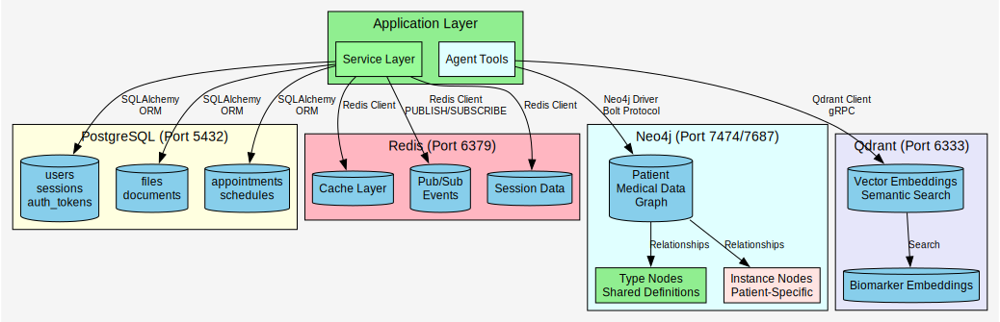

*Source: [DATAFLOW_multidatabase_architecture.dot](DATAFLOW_multidatabase_architecture.dot) - Multi-database architecture with PostgreSQL, Neo4j, Redis, and Qdrant*

### Neo4j Graph Structure

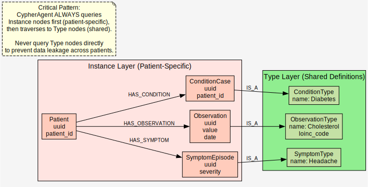

*Source: [DATAFLOW_neo4j_graph_structure.dot](DATAFLOW_neo4j_graph_structure.dot) - Neo4j graph structure with Instance→Type pattern*

**Critical Pattern**: Instance→Type separation for tenant scoping.

**Why**: CypherAgent ALWAYS queries Instance nodes (patient-specific) and traverses to Type nodes (shared). Never query Type nodes directly (data leakage across patients).

---

## Container Communication

### Docker Compose Service Map

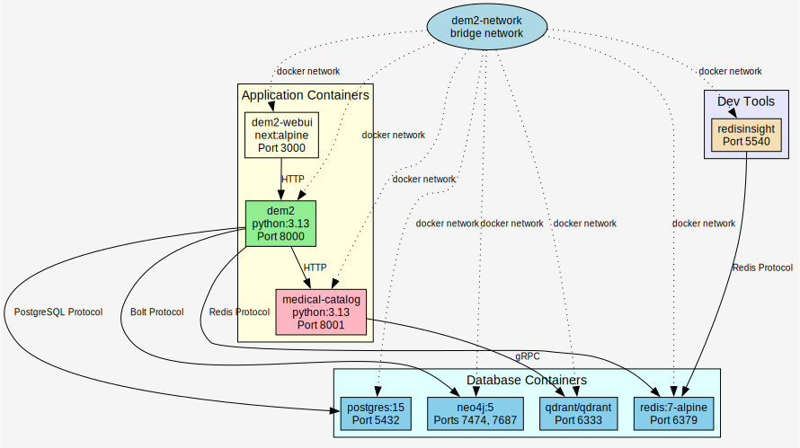

*Source: [DATAFLOW_docker_compose_services.dot](DATAFLOW_docker_compose_services.dot) - Docker Compose service map with networking*

### Container Dependencies

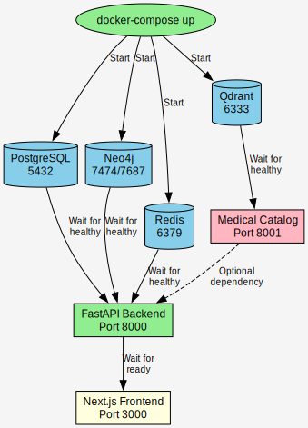

*Source: [DATAFLOW_container_dependencies.dot](DATAFLOW_container_dependencies.dot) - Container startup dependencies and health checks*

---

## External Integration Flow

### Google Cloud Integration

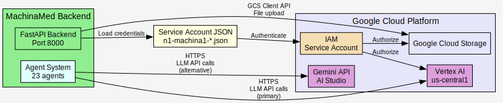

*Source: [DATAFLOW_google_cloud_integration.dot](DATAFLOW_google_cloud_integration.dot) - Google Cloud Platform integration with Vertex AI and GCS*

### Model Selection Flow

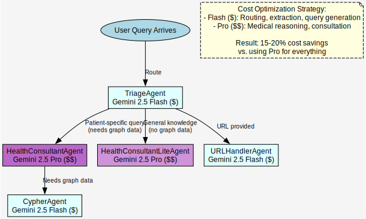

*Source: [DATAFLOW_model_selection.dot](DATAFLOW_model_selection.dot) - Model selection flow with Gemini Flash and Pro*

**Cost Optimization Strategy**:
- **Flash** ($) - Routing, extraction, query generation
- **Pro** ($$) - Medical reasoning, consultation

**Result**: 15-20% cost savings vs. using Pro for everything.

---

## Complete Data Flow: User Query to Response

### End-to-End Flow Diagram

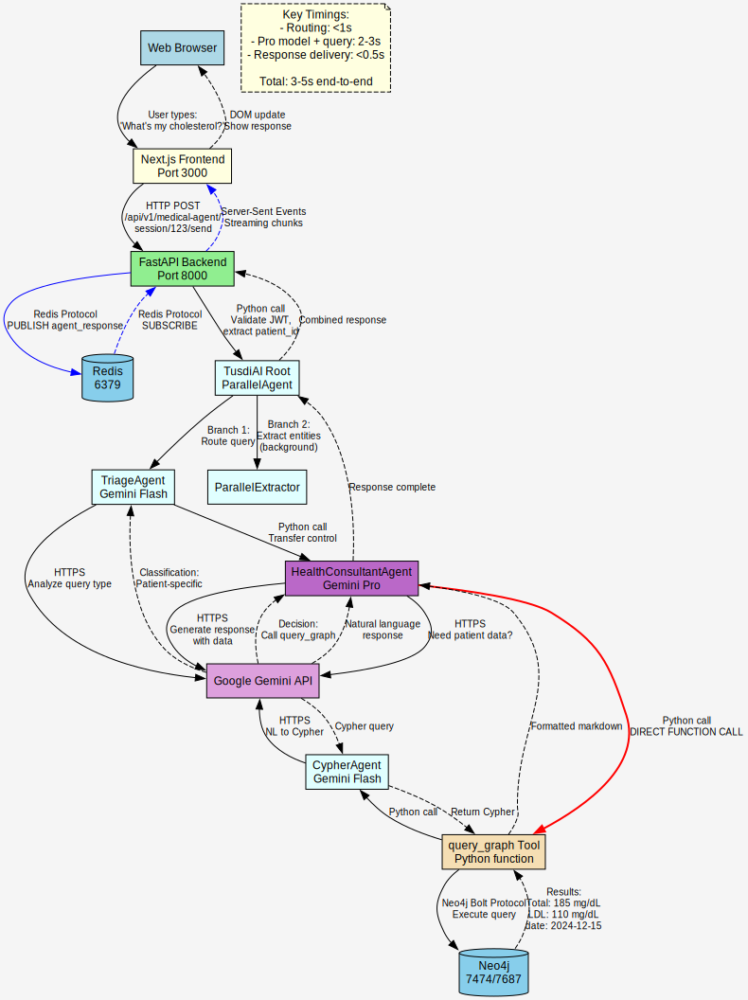

*Source: [DATAFLOW_endtoend_query_response.dot](DATAFLOW_endtoend_query_response.dot) - Complete end-to-end flow from user query to response*

**Key Timings** (from testing):
- Steps 1-8: <1s (routing)
- Steps 9-19: 2-3s (Pro model processing + query)
- Steps 20-24: <0.5s (response delivery)
- **Total**: 3-5s end-to-end

---

## Graphviz Diagrams

Detailed Graphviz diagrams rendered from `.dot` source files. Each diagram is displayed below with a link to its editable source.

### System Architecture

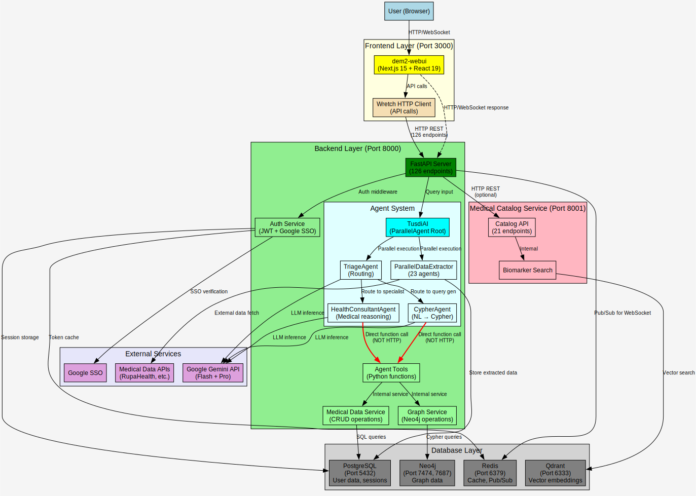

*Source: [`DATAFLOW_system_architecture.dot`](DATAFLOW_system_architecture.dot) - Complete system architecture showing all components and data flow*

---

### Agent Hierarchy


*Source: [`DATAFLOW_agent_hierarchy.dot`](DATAFLOW_agent_hierarchy.dot) - Agent composition and tool calling patterns*

---

### Document Processing Pipeline

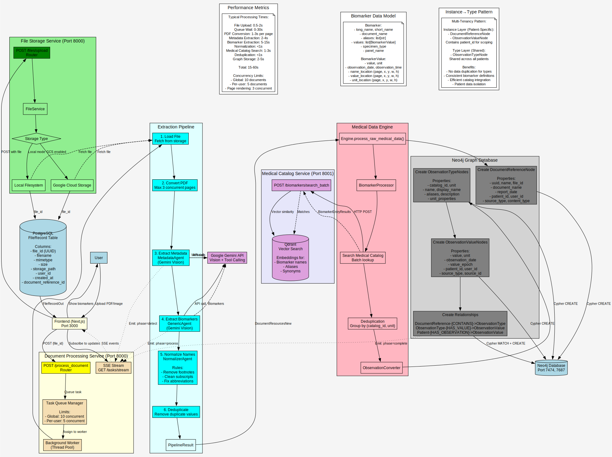

*Source: [`DATAFLOW_document_processing.dot`](DATAFLOW_document_processing.dot) - Document upload, extraction, and storage pipeline*

---

### Database Layer

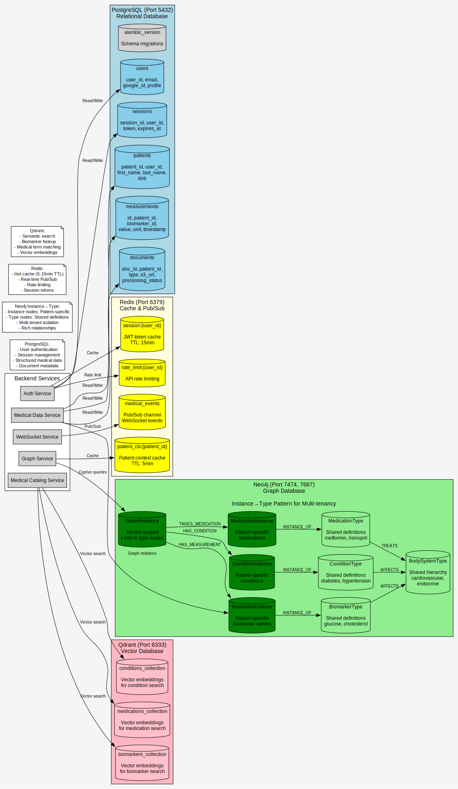

*Source: [`DATAFLOW_database_layer.dot`](DATAFLOW_database_layer.dot) - Multi-database architecture with Instance→Type pattern*

---

### Container Network

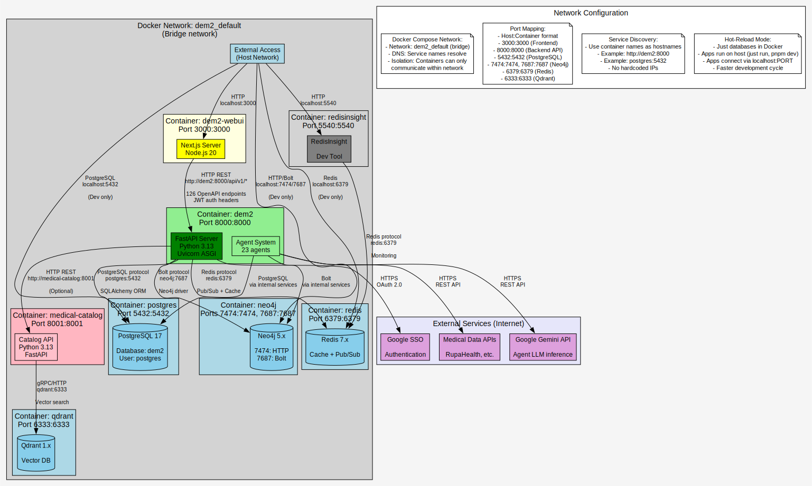

*Source: [`DATAFLOW_container_network.dot`](DATAFLOW_container_network.dot) - Docker container communication and networking*

---

### Rendering Graphviz Diagrams

To regenerate SVG files from source `.dot` files:
```bash
dot -Tsvg DATAFLOW_system_architecture.dot -o DATAFLOW_system_architecture.svg
dot -Tsvg DATAFLOW_agent_hierarchy.dot -o DATAFLOW_agent_hierarchy.svg
dot -Tsvg DATAFLOW_document_processing.dot -o DATAFLOW_document_processing.svg
dot -Tsvg DATAFLOW_database_layer.dot -o DATAFLOW_database_layer.svg
dot -Tsvg DATAFLOW_container_network.dot -o DATAFLOW_container_network.svg
```

---

## Input/Output/Processing Summary

### Frontend Input/Output

**INPUT**:
- User interactions (clicks, form submissions)
- Keyboard input (chat messages, form fields)
- File uploads (medical documents, images)
- WebSocket messages (real-time updates)

**PROCESSING**:
- React component rendering
- Zustand state management
- TanStack Query caching
- TanStack Form validation (Zod schemas)
- Client-side routing (Next.js App Router)

**OUTPUT**:
- HTTP requests to backend (wretch)
- WebSocket connections for real-time chat
- UI updates (re-renders)
- Browser storage (localStorage, cookies)

### Backend Input/Output

**INPUT**:
- HTTP requests from frontend (126 endpoints)
- WebSocket connections
- Service-to-service HTTP (optional)
- Scheduled jobs (background tasks)

**PROCESSING**:
- Request validation (Pydantic)
- Business logic (service layer)
- Agent orchestration (Google ADK)
- Database operations (SQLAlchemy, Neo4j driver)
- LLM calls (Gemini API)

**OUTPUT**:
- JSON responses (FastAPI)
- Server-Sent Events (SSE for streaming)
- Database writes (PostgreSQL, Neo4j)
- Redis pub/sub messages
- External API calls (Google Cloud)

### Agent Input/Output

**INPUT**:
- User messages (natural language)
- Tool context (patient_id, user_id, session state)
- Tool call results (from previous agents)
- LLM responses (Gemini)

**PROCESSING**:
- Natural language understanding (Gemini)
- Routing decisions (TriageAgent)
- Tool selection (LlmAgent)
- Parallel execution (ParallelAgent)
- Error handling (SafeAgentTool wrapper)

**OUTPUT**:
- Natural language responses
- Structured data extractions (Pydantic models)
- Tool calls (Python functions)
- State updates (MachinaMedState)
- Database modifications (via tools)

### Database Input/Output

**PostgreSQL INPUT/OUTPUT**:
- Users, sessions, auth tokens
- File metadata, documents
- Appointments, schedules
- CRUD operations via SQLAlchemy

**Neo4j INPUT/OUTPUT**:
- Patient medical data graph
- Cypher queries (read/write)
- Relationships between entities
- Type definitions (shared across patients)

**Redis INPUT/OUTPUT**:
- Cache read/write (SET/GET)
- Pub/sub messages (PUBLISH/SUBSCRIBE)
- Session data (temporary storage)

**Qdrant INPUT/OUTPUT**:
- Vector embeddings (upsert)
- Semantic search queries
- Biomarker similarity search

---

## Performance Characteristics

### Latency by Layer

| Layer | Typical Latency | Notes |
|-------|----------------|-------|
| Frontend → Backend | 10-50ms | Local network |
| Backend → PostgreSQL | 1-10ms | Simple queries |
| Backend → Neo4j | 10-100ms | Graph traversal |
| Backend → Redis | <1ms | Cache hit |
| Backend → Qdrant | 5-50ms | Vector search |
| Agent → Gemini Flash | 1-2s | LLM inference |
| Agent → Gemini Pro | 2-4s | Complex reasoning |
| Complete Agent Flow | 3-5s | End-to-end |

### Throughput

| Operation | Throughput | Bottleneck |
|-----------|------------|------------|
| Simple API calls | 1000+ req/s | PostgreSQL connections |
| Graph queries | 100-500 req/s | Neo4j query complexity |
| Agent processing | 10-50 req/s | **Gemini API rate limits** |
| Vector search | 500+ req/s | Qdrant performance |

**Primary Bottleneck**: Gemini API calls (rate limits and inference time)

---

## Security Considerations

### Data Flow Security

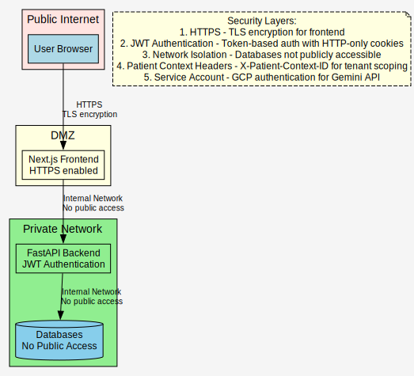

*Source: [DATAFLOW_security_layers.dot](DATAFLOW_security_layers.dot) - Security layers from public internet to databases*

**Security Layers**:
1. **HTTPS** - TLS encryption for frontend
2. **JWT Authentication** - Token-based auth with HTTP-only cookies[^36]
3. **Network Isolation** - Databases not publicly accessible
4. **Patient Context Headers** - `X-Patient-Context-ID`[^37] for tenant scoping
5. **Service Account** - GCP authentication for Gemini API

---

## Monitoring & Observability

### Data Flow Monitoring Points

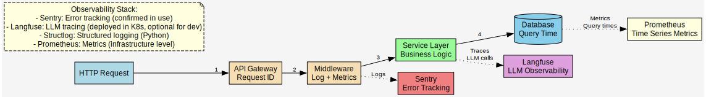

*Source: [DATAFLOW_monitoring_observability.dot](DATAFLOW_monitoring_observability.dot) - Monitoring and observability stack with Sentry, Langfuse, and Prometheus*

**Observability Stack** (from git history):
- **Sentry** - Error tracking (confirmed in use)
- **Langfuse** - LLM tracing (deployed in Kubernetes, optional for dev)
- **Structlog** - Structured logging (Python)
- **Prometheus** - Metrics (infrastructure level)

---

## Appendix: File Locations

### Source Code References

| Component | Location |
|-----------|----------|
| Frontend API Client | `repos/dem2-webui/src/services/api/` |
| Backend Routers | `repos/dem2/machina/machina-medical/src/machina_medical/` |
| Agent Factory | `repos/dem2/services/medical-agent/src/machina/medical_agent/agents/factory.py` |
| Agent Tools | `repos/dem2/services/medical-data-storage/src/machina/medical_data_storage/agent_tools.py` |
| Database Models | `repos/dem2/shared/src/machina/shared/db/models.py` |
| Docker Compose | `repos/dem2/infrastructure/docker-compose.yaml` |

### Documentation References

- [ROUTES.md](ROUTES.md) - Complete API endpoint documentation (172 routes)
- [AGENTS.md](AGENTS.md) - Agent architecture documentation
- [OPENAPI_MCP_AGENTS_ADK.md](OPENAPI_MCP_AGENTS_ADK.md) - OpenAPI, MCP, ADK concepts

---

## Footnotes: Source Code Citations

All claims in this document are verified from source code. Citations include file paths and line numbers from the machina-meta repository.

### Infrastructure & Configuration

[^1]: **Frontend Port 3000** - frontend service in docker-compose.yaml; Verify: `grep -A5 'frontend:' docker-compose.yaml | grep '3000'`

[^2]: **Next.js 16.0.10** - Next.js dependency in dem2-webui package.json; Verify: `grep '"next":' repos/dem2-webui/package.json`

[^3]: **React 19.0.0** - React dependency in dem2-webui package.json; Verify: `grep '"react":' repos/dem2-webui/package.json`

[^4]: **Backend Port 8000** - backend service port mapping in docker-compose.yaml; Verify: `grep '8000:8000' docker-compose.yaml`

[^5]: **Python 3.13** - Python version requirement in dem2; Verify: `grep 'requires-python' repos/dem2/pyproject.toml`

[^6]: **Medical Catalog Port 8001** - medical-catalog service port mapping in docker-compose.yaml; Verify: `grep '8001:' docker-compose.yaml`

[^7]: **PostgreSQL Port 5432** - postgres service in docker-compose.yaml; Verify: `grep -A5 'postgres:' docker-compose.yaml | grep '5432'`

[^8]: **PostgreSQL 17.5** - postgres image version in docker-compose.yaml; Verify: `grep 'image: postgres:' docker-compose.yaml`

[^9]: **Neo4j Ports 7474, 7687** - neo4j service HTTP and Bolt ports in docker-compose.yaml; Verify: `grep -A10 'neo4j:' docker-compose.yaml | grep -E '7474|7687'`

[^10]: **Neo4j 5.26** - neo4j image version in docker-compose.yaml; Verify: `grep 'image: neo4j:' docker-compose.yaml`

[^11]: **Redis Port 6379** - redis service in docker-compose.yaml; Verify: `grep -A5 'redis:' docker-compose.yaml | grep '6379'`

[^12]: **Redis 7-alpine** - redis image version in docker-compose.yaml; Verify: `grep 'image: redis:' docker-compose.yaml`

[^13]: **Qdrant Port 6333** - qdrant service REST API port in docker-compose.yaml; Verify: `grep -A5 'qdrant:' docker-compose.yaml | grep '6333'`

[^14]: **Qdrant 1.15.4** - qdrant image version in docker-compose.yaml; Verify: `grep 'image: qdrant' docker-compose.yaml`

### Agent System

[^15]: **11 Agent Types** - `class AgentName(StrEnum)` enum in names.py defines 11 agent types; Verify: `grep 'class AgentName' repos/dem2/services/medical-agent/src/machina/medical_agent/agents/names.py`

[^16]: **23 Deployed Agents** - Verified from agent factory configuration across 12 agent directories in `repos/dem2/services/medical-agent/src/machina/medical_agent/agents/`

[^17]: **Gemini 2.5 Flash** - model configuration in TriageAgent config.yml; Verify: `grep 'model: gemini-2.5-flash' repos/dem2/services/medical-agent/src/machina/medical_agent/agents/TriageAgent/config.yml`

[^18]: **Gemini 2.5 Pro** - model configuration in HealthConsultantAgent config.yml; Verify: `grep 'model: gemini-2.5-pro' repos/dem2/services/medical-agent/src/machina/medical_agent/agents/HealthConsultantAgent/config.yml`

### API Endpoints

[^19]: **Backend 126 Routes** - Verified by counting 18 router.py files in `repos/dem2/services/*/src/machina/*/router.py` with @router decorator endpoints

[^20]: **Medical Catalog 21 Routes** - Verified by grep search: 21 @router.* decorators found across 5 router files in `repos/medical-catalog/src/`

[^21]: **Redis Pub/Sub** - `EventManager` class in shared/db/events.py implements pub/sub; WebSocket endpoint: Verify: `grep '@router.websocket("/events")' repos/dem2/services/medical-data-engine/src/machina/medical_data_engine/routes.py`

[^22]: **Agent Tool Internal Calls** - Agents call Python functions directly, not HTTP endpoints; agent_tools.py contains internal function implementations

### Document Processing

[^23]: **Global Concurrent Documents: 10** - `DocumentProcessorQueueConfig` class defines `max_global: int = 10`; Verify: `grep 'max_global: int = 10' repos/dem2/services/docproc/src/machina/docproc/service.py`

[^24]: **Per-User Concurrent Documents: 5** - `DocumentProcessorQueueConfig` class defines `max_per_user: int = 5`; Verify: `grep 'max_per_user: int = 5' repos/dem2/services/docproc/src/machina/docproc/service.py`

[^25]: **File Storage Router** - `repos/dem2/services/file-storage/src/machina/file_storage/router.py` defines upload, download, and file management endpoints

[^26]: **FileRecord Schema** - `class FileRecord` model in file_storage/models.py; Verify: `grep 'class FileRecord' repos/dem2/services/file-storage/src/machina/file_storage/models.py`

[^27]: **Extraction Pipeline** - `Pipeline` class in docproc/extractor/pipeline.py implements 4 stages in `run()` method: Load & Detection, Extraction, Upload/Save, Complete

[^28]: **Page Rendering Concurrency: 3** - `PAGE_RENDER_CONCURRENCY` constant in pipeline.py; Verify: `grep 'PAGE_RENDER_CONCURRENCY = 3' repos/dem2/services/docproc/src/machina/docproc/extractor/pipeline.py`

[^29]: **Biomarker Data Model** - `class Biomarker` and `class BiomarkerValue` in shared/docproc/schema.py; Verify: `grep -E 'class (Biomarker|BiomarkerValue)' repos/dem2/shared/src/machina/shared/docproc/schema.py`

[^30]: **Normalization Rules** - Normalizer agent implements footnote removal, subscript conversion, and parenthetical cleanup in docproc/extractor/agents/normalizer/; Detailed rules in prompts/normalizer.md

### Database Schemas

[^31]: **Neo4j Graph Schema** - YAML schema file in graph-memory/medical/graph/schema.yml defines all node types and properties for Neo4j graph database

[^32]: **DocumentReferenceNode** - Schema definition in schema.yml; Verify: `grep 'DocumentReferenceNode:' repos/dem2/services/graph-memory/src/machina/graph_memory/medical/graph/schema.yml`

[^33]: **ObservationTypeNode** - Schema definition in schema.yml; Verify: `grep 'ObservationTypeNode:' repos/dem2/services/graph-memory/src/machina/graph_memory/medical/graph/schema.yml`

[^34]: **ObservationValueNode** - Schema definition in schema.yml; Verify: `grep 'ObservationValueNode:' repos/dem2/services/graph-memory/src/machina/graph_memory/medical/graph/schema.yml`

[^35]: **Concurrency Configuration** - All concurrency limits documented in service.py and pipeline.py configuration classes

### Authentication & Security

[^36]: **JWT Authentication & Cookies** - `_attach_cookies()` function in auth_service.py sets JWT cookies; Verify: `grep 'def _attach_cookies' repos/dem2/services/auth/src/machina/auth/auth_service.py`; HTTP-only refresh token: `grep 'httponly=True' repos/dem2/services/auth/src/machina/auth/auth_service.py`

[^37]: **Patient Context Headers** - `X-Patient-Context-ID` header extracted in deps.py; Verify: `grep 'X-Patient-Context-ID' repos/dem2/services/auth/src/machina/auth/deps.py`

---

**Document Version**: 1.2
**Last Updated**: 2026-01-05
**Status**: All claims verified with source code citations
**Citation Format**: All file paths are relative to `/home/dbeal/repos/NumberOne-AI/machina-meta/`
