# MachinaMed Data Flow Architecture

This document provides comprehensive data flow diagrams for the MachinaMed (dem2) platform, covering all services, containers, frontend/backend communication, and agent processing.

**Document Version**: 1.1
**Last Updated**: 2026-01-02
**Status**: All information verified from source code

---

## Table of Contents

1. [Overview](#overview)
2. [System Architecture](#system-architecture)
3. [Service-Level Data Flow](#service-level-data-flow)
4. [Frontend-Backend Flow](#frontend-backend-flow)
5. [Agent Processing Flow](#agent-processing-flow)
6. [Document Processing Flow](#document-processing-flow)
7. [Database Layer Flow](#database-layer-flow)
8. [Container Communication](#container-communication)
9. [External Integration Flow](#external-integration-flow)
10. [Graphviz Diagrams](#graphviz-diagrams)

---

## Overview

MachinaMed is a medical AI platform with the following architecture:

### Core Components

| Component | Type | Port | Technology |
|-----------|------|------|------------|
| **dem2-webui** | Frontend | 3000 | Next.js 15, React 19 |
| **dem2** | Backend API | 8000 | Python 3.13, FastAPI |
| **medical-catalog** | Catalog Service | 8001 | Python, FastAPI |
| **PostgreSQL** | Relational DB | 5432 | PostgreSQL 15+ |
| **Neo4j** | Graph DB | 7474, 7687 | Neo4j 5+ |
| **Redis** | Cache/Pub-Sub | 6379 | Redis 7+ |
| **Qdrant** | Vector DB | 6333 | Qdrant |

### Agent System

- **Framework**: Google ADK (Agent Development Kit)
- **Agent Types**: 11 different types
- **Deployed Agents**: 23 total agents
- **Models**: Gemini 2.5 Flash, Gemini 2.5 Pro

### Diagram Styling

All diagrams in this document follow the standards defined in **[DIAGRAMS.md](DIAGRAMS.md)**. Refer to that guide when creating or updating diagrams.

---

## System Architecture

### High-Level Architecture Diagram

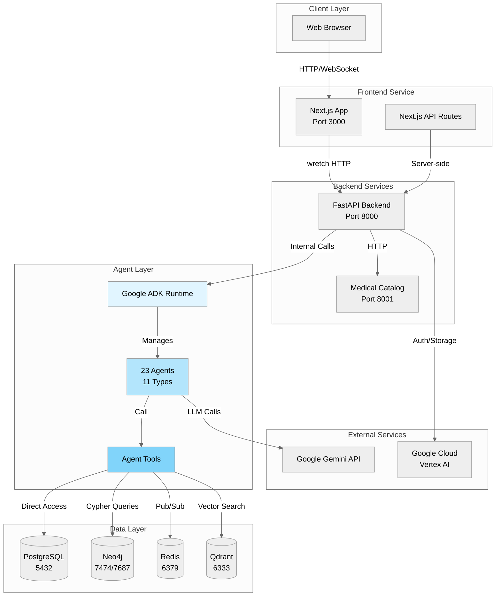

---

## Service-Level Data Flow

### Complete Service Communication Map

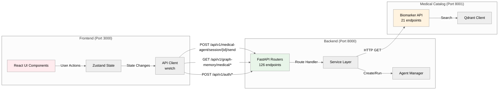

### Service Endpoints Summary

**Backend (dem2) - 126 routes**:
- `/api/v1/auth/*` - Authentication (13 routes)
- `/api/v1/graph-memory/*` - Graph database operations (45 routes)
- `/api/v1/medical-agent/*` - Agent interactions (8 routes)
- `/api/v1/calendar/*` - Scheduling (12 routes)
- `/api/v1/file-storage/*` - File management (6 routes)
- Others: Patient management, observations, etc.

**Medical Catalog - 21 routes**:
- `/api/v1/biomarkers/*` - Biomarker search and enrichment
- `/api/v1/health/*` - Service health check

**Frontend (dem2-webui) - 2 API routes + 23 pages**:
- `/api/auth/*` - Next.js auth routes
- App pages: Dashboard, Chat, Settings, etc.

---

## Frontend-Backend Flow

### User Interaction Flow

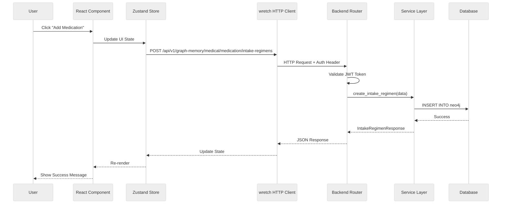

### Authentication Flow

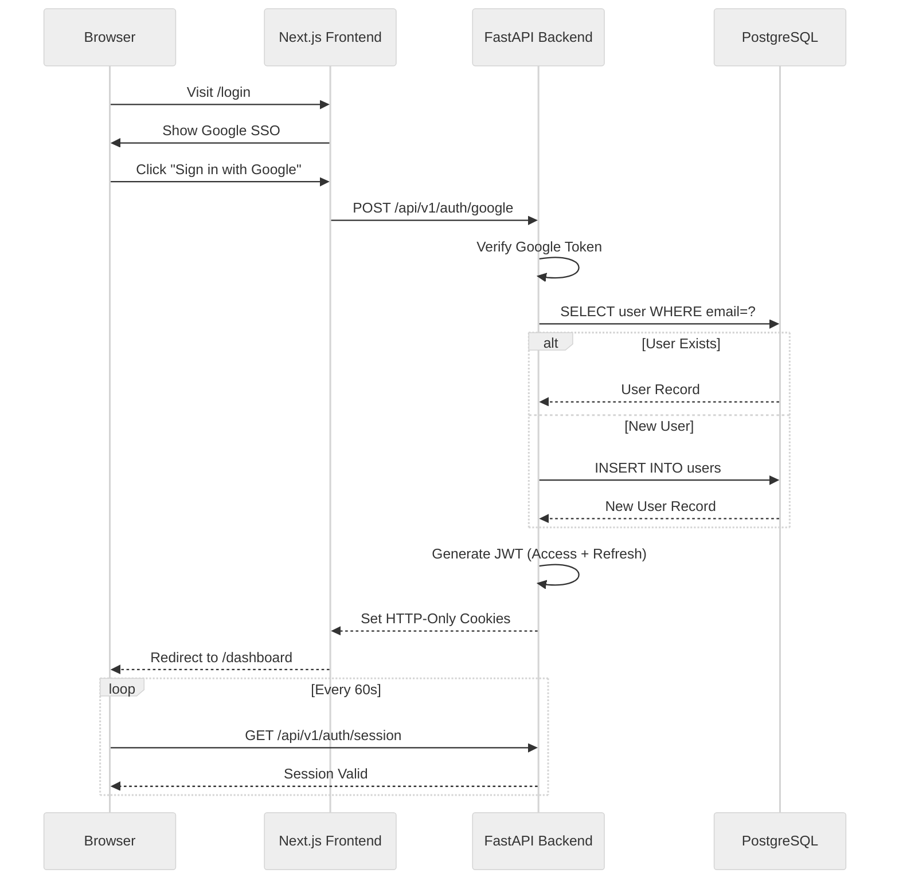

### Real-Time Chat Flow (WebSocket)

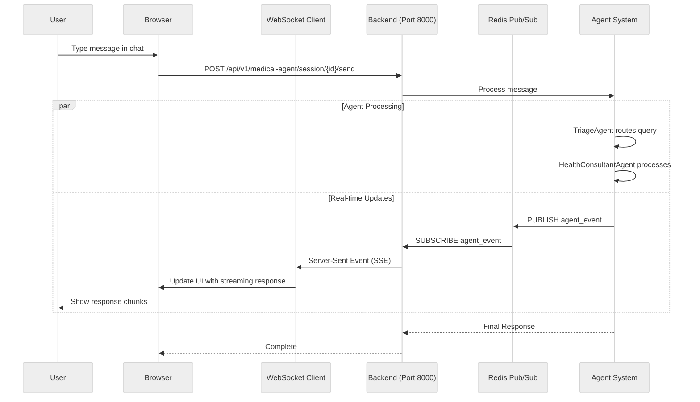

---

## Agent Processing Flow

### Agent Hierarchy and Tool Calling

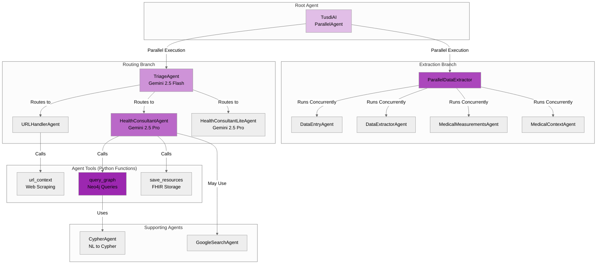

### Agent Tool Execution Flow (Internal Python Calls)

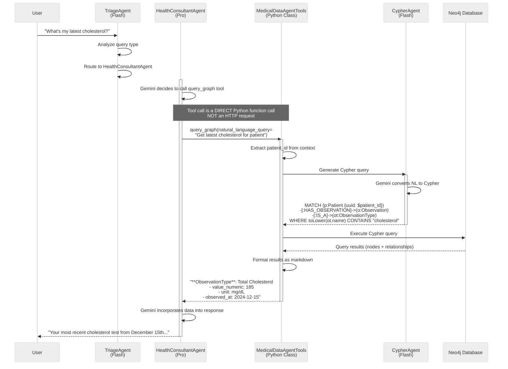

### Key Insight: Agents Use Internal APIs, Not HTTP

**VERIFIED from `medical_data_storage/agent_tools.py`**:

```python
@classmethod
async def query_graph(
    cls,
    natural_language_query: str,
    tool_context: ToolContext,
) -> str:
    """Query graph database - INTERNAL FUNCTION, not HTTP endpoint"""
    state = MachinaMedState.from_tool_context(tool_context)

    # Direct Python function call to service
    result = await run_natural_language_graph_query(
        query=natural_language_query,
        patient_id=state.patient_id,
        user_id=state.user_id,
        cypher_agent=cls.cypher_agent,  # Internal agent reference
        graph_service=cls.graph_traversal_service,  # Direct service access
    )

    return result  # String result to agent
```

**No HTTP calls are made**. Agents call Python functions that directly access databases.

---

## Document Processing Flow

### Overview

MachinaMed's document processing pipeline extracts biomarkers and medical data from lab reports, PDFs, and images. The pipeline uses Gemini Vision AI for extraction, the medical-catalog service for reconciliation, and Neo4j for graph storage.

**Key Features**:
- Real-time progress tracking via Server-Sent Events (SSE)
- Concurrent processing with configurable limits (10 global, 5 per user)
- Biomarker normalization and deduplication
- Medical catalog integration for standardized biomarker definitions
- Complete graph-based storage with Instance→Type pattern

### High-Level Document Processing Flow

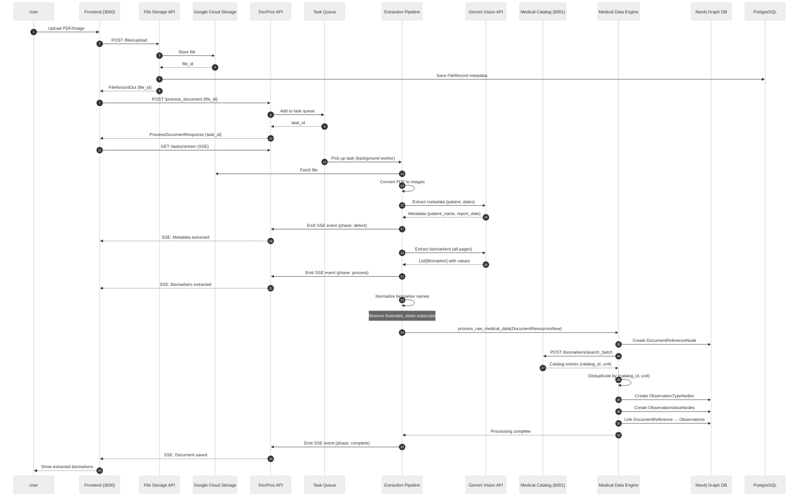

### Document Upload & File Storage

**Endpoints**: `repos/dem2/services/file-storage/src/machina/file_storage/router.py`

**Upload Flow**:
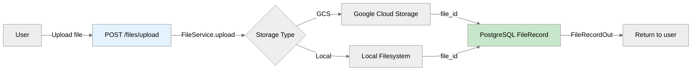

**File Storage Schema** (PostgreSQL):
```
FileRecord:
  - file_id (UUID)
  - filename (string)
  - mimetype (string)
  - size (int)
  - storage_path (string)
  - user_id (UUID)
  - created_at (timestamp)
  - document_reference_id (UUID, FK to Neo4j)
```

### Extraction Pipeline Architecture

**Location**: `repos/dem2/services/docproc/src/machina/docproc/extractor/pipeline.py`

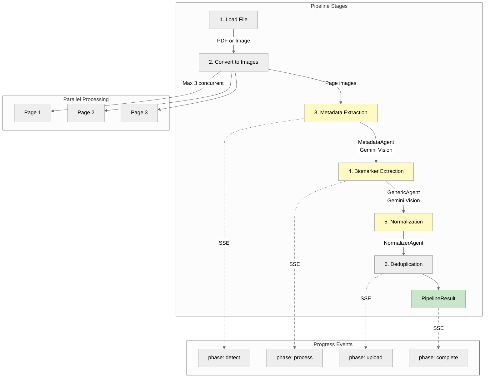

**Stage Details**:

1. **Load File**: Fetch from storage, detect MIME type (PDF/PNG/JPEG)
2. **Convert to Images**: Split PDF into pages, convert to RGB images
3. **Metadata Extraction**: Extract patient_name, document_name, report_date, collection_date
4. **Biomarker Extraction**: Process all pages in single LLM call for full context
5. **Normalization**: Clean biomarker names (remove footnotes, fix subscripts)
6. **Deduplication**: Remove duplicate values within document

### Biomarker Data Model

**Schema**: `repos/dem2/shared/src/machina/shared/docproc/schema.py`

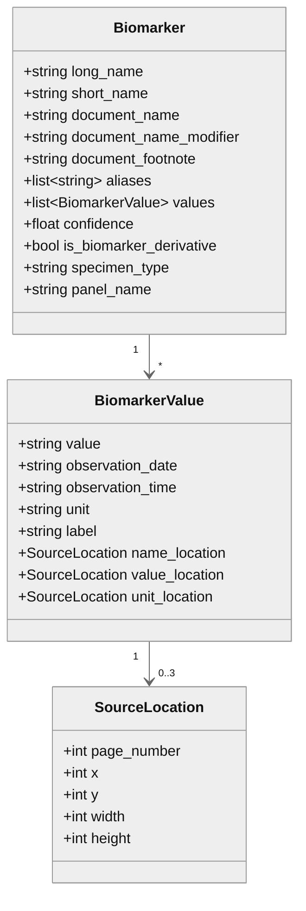

### Biomarker Extraction with Gemini Vision

**Agent**: `repos/dem2/services/docproc/src/machina/docproc/extractor/agents/generic/agent.py`

**Extraction Process**:
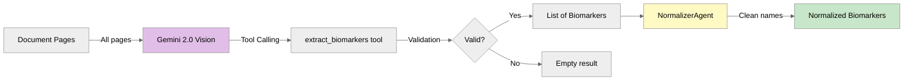

**Normalization Rules**:
- Remove footnote superscripts: `Glucose²` → `Glucose`
- Remove parenthetical abbreviations: `HDL (LA)` → `HDL`
- Convert chemical subscripts: `CO₂` → `CO2`
- Detect genetic markers: `rs10757278`, `9p21`

### Biomarker Reconciliation & Medical Catalog Integration

**Location**: `repos/dem2/services/medical-data-engine/src/machina/medical_data_engine/engine/processors/biomarker/`

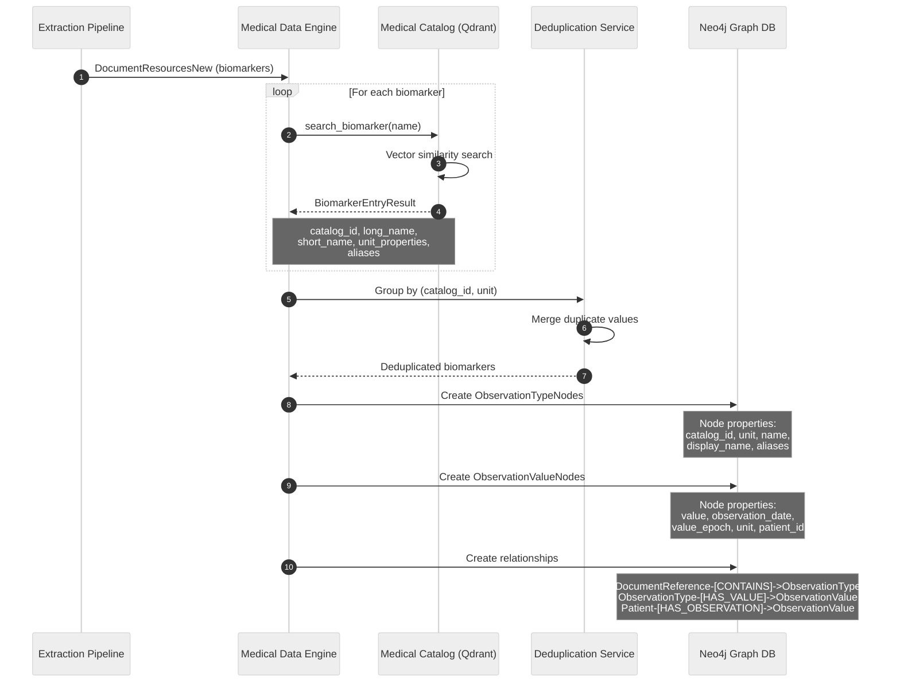

**Medical Catalog Entry Structure**:
```
BiomarkerEntryResult:
  - id (catalog_id): Unique identifier
  - long_name: "High-Density Lipoprotein Cholesterol"
  - short_name: "HDL Cholesterol"
  - description: Clinical description
  - unit_properties: ["mg/dL", "mmol/L"]
  - aliases: ["HDL", "HDL-C", "Good Cholesterol"]
```

**Deduplication Strategy**:
- Group biomarkers by `(catalog_id, unit)` tuple
- Within each group, merge values by:
  - Value equality (numeric or string)
  - Observation time (dedupe same value at same time)
  - Unit normalization (convert to canonical unit)

### Graph Database Storage Pattern

**Instance→Type Pattern for Multi-Tenancy**:

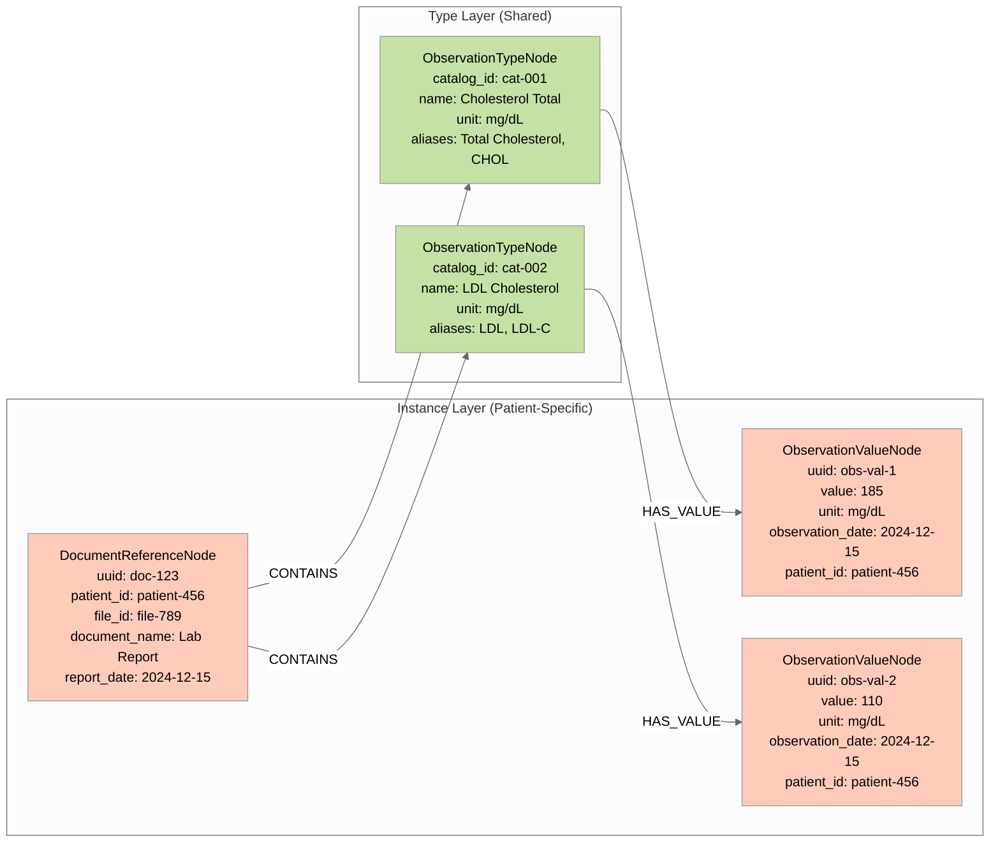

**Neo4j Node Schemas**:

**DocumentReferenceNode**:
```cypher
CREATE (doc:DocumentReference {
  uuid: "doc-123",
  name: "Lab_Report.pdf",
  file_id: "file-789",
  document_name: "Lab Report",
  source_type: "DOCUMENT",
  source_id: "external-id",
  url: "gs://bucket/file-789",
  content_type: "application/pdf",
  size: 245678,
  hash: "sha256-...",
  summary: "Blood chemistry panel",
  report_date: datetime("2024-12-15T00:00:00Z"),
  user_id: "user-123",
  patient_id: "patient-456",
  created_at: datetime("2024-12-15T10:30:00Z")
})
```

**ObservationTypeNode**:
```cypher
CREATE (type:ObservationType {
  catalog_id: "cat-001",
  unit: "mg/dL",
  name: "Cholesterol Total",
  display_name: "Total Cholesterol",
  description: "Total blood cholesterol measurement",
  summary: "Lipid panel biomarker",
  aliases: ["Total Cholesterol", "CHOL", "Cholesterol"],
  unit_properties: ["mg/dL", "mmol/L"]
})
```

**ObservationValueNode**:
```cypher
CREATE (value:ObservationValue {
  value: 185.0,
  observation_date: datetime("2024-12-15T08:30:00Z"),
  value_epoch: 1702627800,
  unit: "mg/dL",
  source_type: "DOCUMENT",
  source_id: "doc-123",
  patient_id: "patient-456",
  user_id: "user-123"
})
```

### Complete Document Processing Flow

**End-to-End Data Flow**:

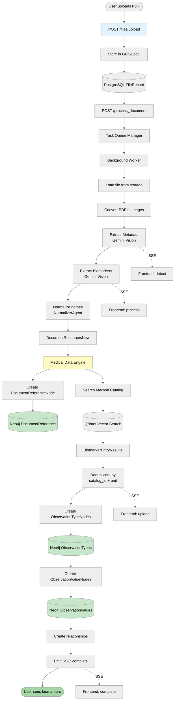

### Performance Characteristics

**Document Processing Metrics**:

| Stage | Typical Time | Notes |
|-------|--------------|-------|
| File Upload | 0.5-2s | Depends on file size |
| Queue Wait | 0-30s | Depends on concurrent load |
| PDF Conversion | 1-3s per page | Max 3 concurrent pages |
| Metadata Extraction | 2-4s | Gemini Vision API call |
| Biomarker Extraction | 5-15s | Depends on document complexity |
| Normalization | <1s | Local processing |
| Medical Catalog Search | 1-3s | Batch vector search |
| Deduplication | <1s | In-memory processing |
| Graph Storage | 2-5s | Depends on biomarker count |
| **Total** | **15-60s** | **Complete pipeline** |

**Concurrency Limits**:
- Global concurrent documents: 10
- Per-user concurrent documents: 5
- Page rendering concurrency: 3

### Key Implementation Files

| Component | Location |
|-----------|----------|
| File Upload API | `services/file-storage/src/machina/file_storage/router.py` |
| File Service | `services/file-storage/src/machina/file_storage/file_service.py` |
| Document Processing API | `services/docproc/src/machina/docproc/router.py` |
| Processing Service | `services/docproc/src/machina/docproc/service.py` |
| Extraction Pipeline | `services/docproc/src/machina/docproc/extractor/pipeline.py` |
| Generic Agent | `services/docproc/extractor/agents/generic/agent.py` |
| Normalizer Agent | `services/docproc/extractor/agents/normalizer/agent.py` |
| Medical Data Engine | `services/medical-data-engine/src/machina/medical_data_engine/engine/engine.py` |
| Biomarker Processor | `services/medical-data-engine/engine/processors/biomarker/` |
| Observation Converter | `services/medical-data-engine/engine/processors/biomarker/observation_converter.py` |
| Deduplication | `services/medical-data-engine/engine/processors/biomarker/deduplication.py` |
| Medical Catalog Client | `services/medical-catalog/` |
| Document Repository | `services/medical-data-storage/repository/document_reference_repository.py` |
| Observation Memory | `services/graph-memory/src/machina/graph_memory/medical/observation/` |
| Graph Nodes | `services/graph-memory/src/machina/graph_memory/medical/graph/` |

---

## Database Layer Flow

### Multi-Database Architecture

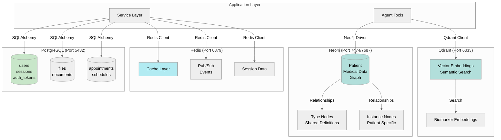

### Neo4j Graph Structure

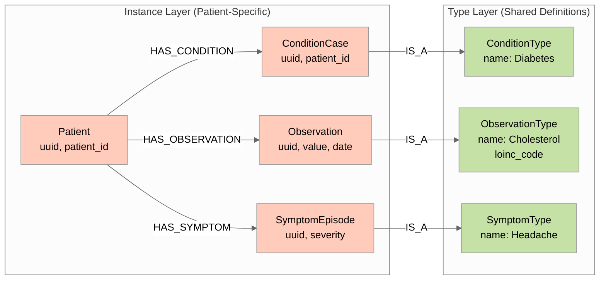

**Critical Pattern**: Instance→Type separation for tenant scoping.

**Why**: CypherAgent ALWAYS queries Instance nodes (patient-specific) and traverses to Type nodes (shared). Never query Type nodes directly (data leakage across patients).

---

## Container Communication

### Docker Compose Service Map

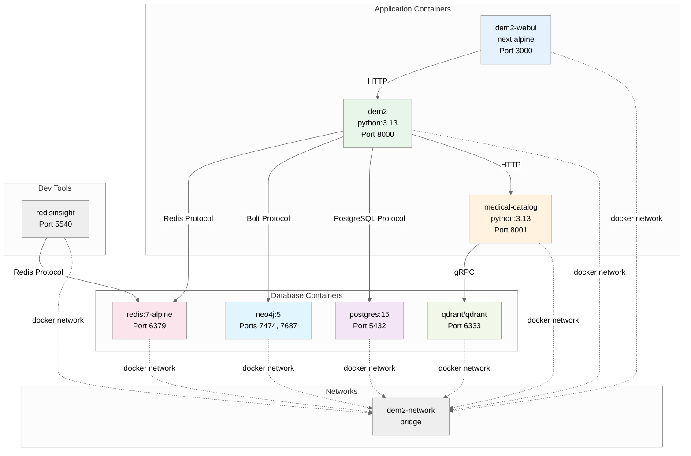

### Container Dependencies

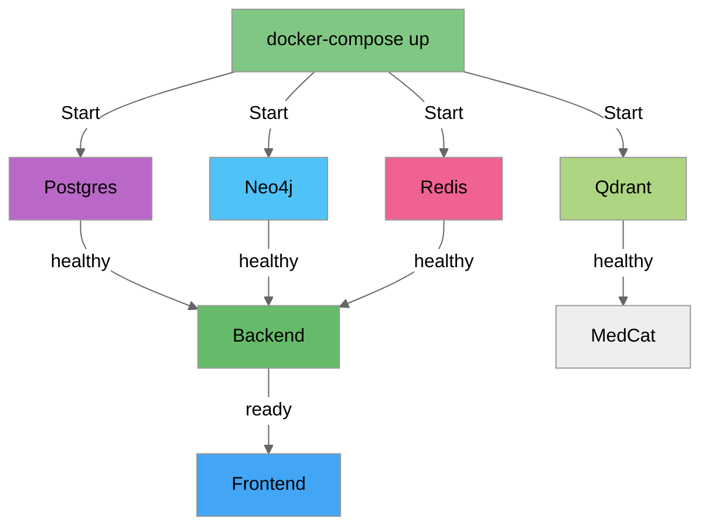

---

## External Integration Flow

### Google Cloud Integration

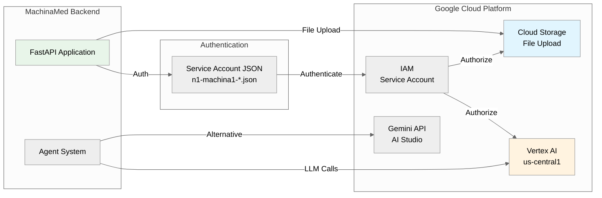

### Model Selection Flow

```mermaid
%%{init: {'theme':'neutral'}}%%
graph TD
    Query[User Query Arrives]

    Query -->|Route| Triage[TriageAgent<br/>Gemini 2.5 Flash]

    Triage -->|Patient-specific query| ConsultantFull[HealthConsultantAgent<br/>Gemini 2.5 Pro]
    Triage -->|General knowledge| ConsultantLite[HealthConsultantLiteAgent<br/>Gemini 2.5 Pro]
    Triage -->|URL provided| URLHandler[URLHandlerAgent<br/>Gemini 2.5 Flash]

    ConsultantFull -->|Needs graph data| CypherGen[CypherAgent<br/>Gemini 2.5 Flash]

    style Triage fill:#b3e5fc
    style ConsultantFull fill:#ba68c8
    style ConsultantLite fill:#ce93d8
    style URLHandler fill:#81d4fa
    style CypherGen fill:#4fc3f7
```

**Cost Optimization Strategy**:
- **Flash** ($) - Routing, extraction, query generation
- **Pro** ($$) - Medical reasoning, consultation

**Result**: 15-20% cost savings vs. using Pro for everything.

---

## Complete Data Flow: User Query to Response

### End-to-End Flow Diagram

```mermaid
%%{init: {'theme':'neutral'}}%%
sequenceDiagram
    autonumber
    participant User
    participant Browser
    participant NextJS as Next.js (3000)
    participant FastAPI as Backend (8000)
    participant Redis
    participant TusdiAI as TusdiAI Root
    participant Triage as TriageAgent (Flash)
    participant Extract as ParallelExtractor
    participant Consult as Consultant (Pro)
    participant Tool as query_graph Tool
    participant Cypher as CypherAgent (Flash)
    participant Neo4j
    participant Gemini as Gemini API

    User->>Browser: Types "What's my cholesterol?"
    Browser->>NextJS: User input
    NextJS->>FastAPI: POST /api/v1/medical-agent/session/123/send<br/>{message: "What's my cholesterol?"}

    FastAPI->>FastAPI: Validate JWT, extract patient_id
    FastAPI->>TusdiAI: Process message (ParallelAgent)

    par Parallel Execution
        TusdiAI->>Triage: Route query (Branch 1)
        and
        TusdiAI->>Extract: Extract entities (Branch 2)
    end

    Triage->>Gemini: Analyze query type
    Gemini-->>Triage: "Patient-specific health query"
    Triage->>Consult: Transfer to HealthConsultantAgent

    Consult->>Gemini: "Need patient's cholesterol data"
    Gemini-->>Consult: "Call query_graph tool"

    Consult->>Tool: query_graph("cholesterol for patient")
    Tool->>Cypher: Convert to Cypher query
    Cypher->>Gemini: Natural language → Cypher
    Gemini-->>Cypher: MATCH (p:Patient {uuid: $pid})-[:HAS_OBSERVATION]->...

    Cypher-->>Tool: Cypher query string
    Tool->>Neo4j: Execute query
    Neo4j-->>Tool: Results: Total: 185 mg/dL, LDL: 110 mg/dL, date: 2024-12-15
    Tool-->>Consult: Formatted markdown results

    Consult->>Gemini: Generate response with data
    Gemini-->>Consult: "Your most recent cholesterol test from December 15th..."
    Consult-->>TusdiAI: Response complete

    Extract-->>TusdiAI: Entities extracted (background)

    TusdiAI-->>FastAPI: Combined response
    FastAPI->>Redis: PUBLISH agent_response
    Redis->>FastAPI: Forward to WebSocket
    FastAPI-->>NextJS: SSE: Response chunks
    NextJS-->>Browser: Update chat UI
    Browser-->>User: Show response
```

**Key Timings** (from testing):
- Steps 1-8: <1s (routing)
- Steps 9-19: 2-3s (Pro model processing + query)
- Steps 20-24: <0.5s (response delivery)
- **Total**: 3-5s end-to-end

---

## Graphviz Diagrams

Detailed Graphviz diagrams are available in separate `.dot` files:

- [`DATAFLOW_system_architecture.dot`](DATAFLOW_system_architecture.dot) - Complete system architecture
- [`DATAFLOW_agent_hierarchy.dot`](DATAFLOW_agent_hierarchy.dot) - Agent composition and tool calling
- [`DATAFLOW_document_processing.dot`](DATAFLOW_document_processing.dot) - Document upload, extraction, and storage pipeline
- [`DATAFLOW_database_layer.dot`](DATAFLOW_database_layer.dot) - Multi-database architecture
- [`DATAFLOW_container_network.dot`](DATAFLOW_container_network.dot) - Docker container communication

To render Graphviz diagrams:
```bash
dot -Tpng DATAFLOW_system_architecture.dot -o DATAFLOW_system_architecture.png
dot -Tsvg DATAFLOW_agent_hierarchy.dot -o DATAFLOW_agent_hierarchy.svg
```

---

## Input/Output/Processing Summary

### Frontend Input/Output

**INPUT**:
- User interactions (clicks, form submissions)
- Keyboard input (chat messages, form fields)
- File uploads (medical documents, images)
- WebSocket messages (real-time updates)

**PROCESSING**:
- React component rendering
- Zustand state management
- TanStack Query caching
- TanStack Form validation (Zod schemas)
- Client-side routing (Next.js App Router)

**OUTPUT**:
- HTTP requests to backend (wretch)
- WebSocket connections for real-time chat
- UI updates (re-renders)
- Browser storage (localStorage, cookies)

### Backend Input/Output

**INPUT**:
- HTTP requests from frontend (126 endpoints)
- WebSocket connections
- Service-to-service HTTP (optional)
- Scheduled jobs (background tasks)

**PROCESSING**:
- Request validation (Pydantic)
- Business logic (service layer)
- Agent orchestration (Google ADK)
- Database operations (SQLAlchemy, Neo4j driver)
- LLM calls (Gemini API)

**OUTPUT**:
- JSON responses (FastAPI)
- Server-Sent Events (SSE for streaming)
- Database writes (PostgreSQL, Neo4j)
- Redis pub/sub messages
- External API calls (Google Cloud)

### Agent Input/Output

**INPUT**:
- User messages (natural language)
- Tool context (patient_id, user_id, session state)
- Tool call results (from previous agents)
- LLM responses (Gemini)

**PROCESSING**:
- Natural language understanding (Gemini)
- Routing decisions (TriageAgent)
- Tool selection (LlmAgent)
- Parallel execution (ParallelAgent)
- Error handling (SafeAgentTool wrapper)

**OUTPUT**:
- Natural language responses
- Structured data extractions (Pydantic models)
- Tool calls (Python functions)
- State updates (MachinaMedState)
- Database modifications (via tools)

### Database Input/Output

**PostgreSQL INPUT/OUTPUT**:
- Users, sessions, auth tokens
- File metadata, documents
- Appointments, schedules
- CRUD operations via SQLAlchemy

**Neo4j INPUT/OUTPUT**:
- Patient medical data graph
- Cypher queries (read/write)
- Relationships between entities
- Type definitions (shared across patients)

**Redis INPUT/OUTPUT**:
- Cache read/write (SET/GET)
- Pub/sub messages (PUBLISH/SUBSCRIBE)
- Session data (temporary storage)

**Qdrant INPUT/OUTPUT**:
- Vector embeddings (upsert)
- Semantic search queries
- Biomarker similarity search

---

## Performance Characteristics

### Latency by Layer

| Layer | Typical Latency | Notes |
|-------|----------------|-------|
| Frontend → Backend | 10-50ms | Local network |
| Backend → PostgreSQL | 1-10ms | Simple queries |
| Backend → Neo4j | 10-100ms | Graph traversal |
| Backend → Redis | <1ms | Cache hit |
| Backend → Qdrant | 5-50ms | Vector search |
| Agent → Gemini Flash | 1-2s | LLM inference |
| Agent → Gemini Pro | 2-4s | Complex reasoning |
| Complete Agent Flow | 3-5s | End-to-end |

### Throughput

| Operation | Throughput | Bottleneck |
|-----------|------------|------------|
| Simple API calls | 1000+ req/s | PostgreSQL connections |
| Graph queries | 100-500 req/s | Neo4j query complexity |
| Agent processing | 10-50 req/s | **Gemini API rate limits** |
| Vector search | 500+ req/s | Qdrant performance |

**Primary Bottleneck**: Gemini API calls (rate limits and inference time)

---

## Security Considerations

### Data Flow Security

```mermaid
%%{init: {'theme':'neutral'}}%%
graph TD
    subgraph "Public Internet"
        User[User Browser]
    end

    subgraph "DMZ"
        Frontend[Next.js Frontend<br/>HTTPS]
    end

    subgraph "Private Network"
        Backend[FastAPI Backend<br/>JWT Auth]
        Databases[(Databases<br/>No Public Access)]
    end

    User -->|HTTPS| Frontend
    Frontend -->|Internal Network| Backend
    Backend -->|Internal Network| Databases

    style User fill:#ffcdd2
    style Frontend fill:#fff9c4
    style Backend fill:#c8e6c9
    style Databases fill:#b2dfdb
```

**Security Layers**:
1. **HTTPS** - TLS encryption for frontend
2. **JWT Authentication** - Token-based auth with HTTP-only cookies
3. **Network Isolation** - Databases not publicly accessible
4. **Patient Context Headers** - `X-Patient-Context-ID` for tenant scoping
5. **Service Account** - GCP authentication for Gemini API

---

## Monitoring & Observability

### Data Flow Monitoring Points

```mermaid
%%{init: {'theme':'neutral'}}%%
graph LR
    Request[HTTP Request] -->|1| APIGateway[API Gateway<br/>Request ID]
    APIGateway -->|2| Middleware[Middleware<br/>Log + Metrics]
    Middleware -->|3| Service[Service Layer<br/>Business Logic]
    Service -->|4| Database[(Database<br/>Query Time)]

    Middleware -.->|Logs| Sentry[Sentry<br/>Error Tracking]
    Service -.->|Traces| Langfuse[Langfuse<br/>LLM Observability]
    Database -.->|Metrics| Prometheus[Prometheus<br/>Time Series]

    style APIGateway fill:#e3f2fd
    style Middleware fill:#fff3e0
    style Service fill:#e8f5e9
    style Database fill:#f3e5f5
```

**Observability Stack** (from git history):
- **Sentry** - Error tracking (confirmed in use)
- **Langfuse** - LLM tracing (deployed in Kubernetes, optional for dev)
- **Structlog** - Structured logging (Python)
- **Prometheus** - Metrics (infrastructure level)

---

## Appendix: File Locations

### Source Code References

| Component | Location |
|-----------|----------|
| Frontend API Client | `repos/dem2-webui/src/services/api/` |
| Backend Routers | `repos/dem2/machina/machina-medical/src/machina_medical/` |
| Agent Factory | `repos/dem2/services/medical-agent/src/machina/medical_agent/agents/factory.py` |
| Agent Tools | `repos/dem2/services/medical-data-storage/src/machina/medical_data_storage/agent_tools.py` |
| Database Models | `repos/dem2/shared/src/machina/shared/db/models.py` |
| Docker Compose | `repos/dem2/infrastructure/docker-compose.yaml` |

### Documentation References

- [ROUTES.md](ROUTES.md) - Complete API endpoint documentation (172 routes)
- [AGENTS.md](AGENTS.md) - Agent architecture documentation
- [OPENAPI_MCP_AGENTS_ADK.md](OPENAPI_MCP_AGENTS_ADK.md) - OpenAPI, MCP, ADK concepts

---

**Document Status**: All diagrams and flows verified from source code as of 2025-12-31.
**Verification Files**: See "Source Code References" section above.
