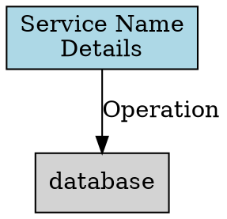

# DATAFLOW Documentation Generation Guide

This document describes the **repeatable process** for generating and maintaining the MachinaMed data flow documentation (`DATAFLOW.md` and associated `.dot` files).

## Purpose

The DATAFLOW documentation provides comprehensive visual and textual documentation of how data flows through the entire MachinaMed system. It is a **living document** that must be kept in sync with the actual implementation as the system evolves.

## When to Regenerate

Regenerate or update DATAFLOW documentation when:

1. **Architecture changes**: Adding/removing services, databases, or major components
2. **API changes**: New endpoints, modified request/response patterns, changed communication protocols
3. **Agent system changes**: New agents, modified tool calling patterns, state management updates
4. **Document processing changes**: Pipeline modifications, new extraction agents, catalog integration updates
5. **Database schema changes**: New node types, relationship changes, query patterns
6. **Data flow changes**: New integration points, modified authentication flows, caching strategies

## Files Managed

### Primary Documentation
- **`docs/DATAFLOW.md`** - Main documentation with Mermaid diagrams (1,410+ lines)

### Graphviz Diagrams
- **`docs/DATAFLOW_system_architecture.dot`** - Complete system component and data flow
- **`docs/DATAFLOW_agent_hierarchy.dot`** - Agent composition and internal tool calling
- **`docs/DATAFLOW_document_processing.dot`** - Document upload, extraction, and storage pipeline
- **`docs/DATAFLOW_database_layer.dot`** - Multi-database architecture with Instance→Type pattern
- **`docs/DATAFLOW_container_network.dot`** - Docker container communication and networking

## Regeneration Process

### Phase 1: Research and Verification

**Objective**: Gather accurate, verified information about current system architecture.

#### 1.1 Use the Explore Agent

For comprehensive research across multiple files, use the Task tool with `subagent_type=Explore`:

```
Task with prompt:
"Find all code related to [TOPIC] in the [REPO] repository. I need to understand:
1. [Specific aspect 1]
2. [Specific aspect 2]
...

Look for:
- [File patterns or keywords]
- [Service names or components]

Thoroughness: very thorough"
```

**Example Topics:**
- System architecture: Services, databases, external integrations
- API routes: Endpoint definitions, routers, request/response models
- Agent system: Agent factories, tool definitions, state management
- Document processing: Pipeline stages, extraction agents, catalog integration
- Database operations: Graph queries, ORM models, repository patterns

#### 1.2 Verify by Reading Source Code

**CRITICAL**: Never assume or guess. Always read the actual implementation.

For each data flow:
1. **Read router files** to verify HTTP endpoints
2. **Read service files** to verify business logic and data transformations
3. **Read repository files** to verify database operations
4. **Read schema files** to verify data models
5. **Read config files** to verify settings and feature flags

**Example verification steps:**

```bash
# Verify API endpoints
Read: repos/dem2/services/file-storage/src/machina/file_storage/router.py
Read: repos/dem2/services/docproc/src/machina/docproc/router.py

# Verify service logic
Read: repos/dem2/services/docproc/src/machina/docproc/service.py
Read: repos/dem2/services/docproc/src/machina/docproc/extractor/pipeline.py

# Verify database schemas
Read: repos/dem2/services/graph-memory/src/machina/graph_memory/medical/graph/document/nodes.py
Read: repos/dem2/services/graph-memory/src/machina/graph_memory/medical/graph/observation/nodes.py

# Verify agent composition
Read: repos/dem2/services/medical-agent/src/machina/medical_agent/agents/factory.py
Read: repos/dem2/services/medical-data-storage/src/machina/medical_data_storage/agent_tools.py
```

#### 1.3 Trace Data Flows

For each major data flow, trace from entry point to storage:

**Example: Document Processing Flow**
1. **Entry**: `POST /files/upload` in file-storage router
2. **Storage**: FileService stores in GCS/Local + PostgreSQL FileRecord
3. **Processing**: `POST /process_document` queues task
4. **Pipeline**: Extraction pipeline runs (Load → Convert → Extract → Normalize)
5. **Catalog**: Medical Catalog search via Qdrant vector search
6. **Engine**: Medical Data Engine processes biomarkers
7. **Graph**: Neo4j storage (DocumentReference → ObservationType → ObservationValue)

**Document each hop:**
- Component name
- Function/method called
- Data transformation
- Database operation (if any)
- External API call (if any)

### Phase 2: Documentation Updates

**Objective**: Update DATAFLOW.md and .dot files with verified information.

#### 2.1 Update Version and Date

In `docs/DATAFLOW.md`:
```markdown
**Document Version**: X.Y (increment minor for additions, major for restructuring)
**Last Updated**: YYYY-MM-DD
**Status**: All information verified from source code
```

#### 2.2 Update Table of Contents

Add new sections if architecture expanded.

#### 2.3 Update or Add Mermaid Diagrams

**Mermaid Syntax Guidelines:**
- Use `graph TB` (top-bottom) or `graph LR` (left-right) for flowcharts
- Use `sequenceDiagram` for step-by-step interactions
- Use `classDiagram` for data models
- Use `flowchart TB` for complex flows with decision points

**Quote special characters in labels:**
```mermaid
API -->|"POST /api/v1/medical-agent/session/{id}/send"| Router
```

**Avoid quotes inside node brackets:**
```mermaid
# Good
CT[ConditionType<br/>name: Diabetes]

# Bad (causes parse errors)
CT[ConditionType<br/>name: "Diabetes"]
```

#### 2.4 Update Section Content

For each section that changed:
1. Update prose descriptions with verified facts
2. Update code examples with actual source code
3. Update file location references
4. Update performance metrics if measured
5. Add "VERIFIED" annotations where appropriate

#### 2.5 Update Graphviz .dot Files

**When to update .dot files:**
- Adding new major components to system architecture
- Changing agent hierarchy or composition
- Modifying document processing pipeline
- Changing database relationships or patterns
- Adding new services or containers

**Graphviz Syntax:**


**Styling conventions:**
- `fillcolor=lightblue`: External/user-facing
- `fillcolor=lightgreen`: Backend services
- `fillcolor=lightyellow`: Frontend/UI
- `fillcolor=lightpink`: Processing/engine
- `fillcolor=lightgray`: Infrastructure/database
- `fillcolor=white`: Documentation/notes

### Phase 3: Validation

**Objective**: Ensure all diagrams render correctly and information is accurate.

#### 3.1 Test Mermaid Diagrams Locally

Use Mermaid CLI or online editor:
```bash
# Install Mermaid CLI
npm install -g @mermaid-js/mermaid-cli

# Render diagram
mmdc -i diagram.mmd -o diagram.png
```

Or use https://mermaid.live/

#### 3.2 Test Graphviz Diagrams

```bash
# Install Graphviz
# Ubuntu/Debian: apt-get install graphviz
# macOS: brew install graphviz

# Render to PNG
dot -Tpng DATAFLOW_system_architecture.dot -o output.png

# Render to SVG
dot -Tsvg DATAFLOW_agent_hierarchy.dot -o output.svg
```

#### 3.3 Verify on GitHub

After pushing:
1. Open DATAFLOW.md on GitHub
2. Verify all Mermaid diagrams render correctly
3. Check for syntax errors in diagram blocks
4. Verify all internal links work

### Phase 4: Documentation and Commit

**Objective**: Record the update and commit with proper context.

#### 4.1 Update TODO.md

Add or update task entry:
```markdown
- [REVIEW] **Update DATAFLOW.md for [CHANGE]** - Document [description]
  - Impact: HIGH | Added: YYYY-MM-DD
  - Updated sections: [list]
  - Verified from source code: [file locations]
  - New diagrams: [list]
  - Updated diagrams: [list]
  - Files modified:
    - docs/DATAFLOW.md (version X.Y)
    - docs/DATAFLOW_[name].dot
  - Commit: [hash] - "docs: [description]"
  - Status: Awaiting user review and approval.
```

#### 4.2 Commit Changes

```bash
git add docs/DATAFLOW.md docs/DATAFLOW_*.dot

git commit -m "docs: update DATAFLOW.md for [CHANGE]

Updated documentation sections:
- [Section 1]: [description of changes]
- [Section 2]: [description of changes]

Added/updated diagrams:
- [Diagram 1]: [what changed]
- [Diagram 2]: [what changed]

Verified from source code:
- [File location 1]
- [File location 2]

Version: X.Y → X.Z
"
```

#### 4.3 Update TODO.md and Commit

```bash
git add TODO.md
git commit -m "chore: add DATAFLOW.md update task to TODO.md"
```

## Common Update Scenarios

### Scenario 1: New Service Added

**Example**: Adding a new "notification-service"

1. **Research**:
   - Explore notification-service code for API endpoints
   - Verify integration points with existing services
   - Check database operations

2. **Update DATAFLOW.md**:
   - Add service to "Core Components" table
   - Update "System Architecture" diagram with new service node
   - Add new section if service has complex data flows
   - Update "Service-Level Data Flow" diagram

3. **Update .dot files**:
   - Add notification-service to `DATAFLOW_system_architecture.dot`
   - Update `DATAFLOW_container_network.dot` if it's containerized

### Scenario 2: Agent Tool Calling Pattern Changed

**Example**: Agents now use HTTP instead of internal Python calls

1. **Research**:
   - Read agent_tools.py to verify new pattern
   - Check for HTTP client initialization
   - Verify endpoint URLs and authentication

2. **Update DATAFLOW.md**:
   - Update "Agent Processing Flow" section
   - Modify "Agent tool execution flow" diagram
   - Update code examples
   - Update key findings (remove "NOT HTTP" emphasis)

3. **Update .dot files**:
   - Update `DATAFLOW_agent_hierarchy.dot` with HTTP arrows
   - Change labels from "Direct Python call" to "HTTP POST"

### Scenario 3: Document Processing Pipeline Modified

**Example**: Added new "validation" stage after normalization

1. **Research**:
   - Read pipeline.py to verify new stage
   - Check validation rules and error handling
   - Verify SSE event emissions

2. **Update DATAFLOW.md**:
   - Update "Extraction Pipeline Architecture" diagram
   - Add new stage: "6. Validation"
   - Update "Stage Details" list
   - Update performance metrics if validation adds time

3. **Update .dot files**:
   - Update `DATAFLOW_document_processing.dot`
   - Add validation node between normalize and deduplicate
   - Add timing annotation for validation stage

### Scenario 4: Database Schema Changed

**Example**: ObservationValue now has "confidence_score" field

1. **Research**:
   - Read observation nodes.py to verify new field
   - Check repository methods that create/update observations
   - Verify if graph queries use the field

2. **Update DATAFLOW.md**:
   - Update "Neo4j Node Schemas" Cypher example
   - Add confidence_score to ObservationValueNode definition
   - Update "Graph Database Storage Pattern" diagram if field is significant

3. **Update .dot files**:
   - Update `DATAFLOW_database_layer.dot`
   - Add confidence_score to ObservationValue node label

## Best Practices

### 1. Always Verify, Never Assume

- Read the actual source code
- Don't rely on memory or previous documentation
- Verify file paths and line numbers
- Check for recent changes in git history

### 2. Use Consistent Terminology

- Service names: Use exact names from codebase (e.g., "dem2", not "backend")
- Database names: PostgreSQL (not Postgres), Neo4j (not neo4j)
- Technology names: Next.js (not NextJS), FastAPI (not FastApi)

### 3. Include Evidence

- Reference specific file paths
- Quote relevant code snippets
- Cite line numbers when helpful
- Link to related documentation

### 4. Keep Diagrams Maintainable

- Use subgraphs to organize complex diagrams
- Add comments in .dot files explaining sections
- Use consistent color schemes across diagrams
- Limit diagram complexity (split if >30 nodes)

### 5. Test Before Committing

- Render all Mermaid diagrams locally or in live editor
- Render all Graphviz diagrams with `dot` command
- Check for syntax errors and layout issues
- Verify all diagrams render on GitHub after push

## Troubleshooting

### Mermaid Diagram Won't Render on GitHub

**Common issues:**
1. Quotes inside node labels: Remove or escape quotes
2. Special characters in edge labels: Wrap label in quotes
3. Unclosed subgraphs: Verify all `subgraph` have `end`
4. Invalid syntax: Test in https://mermaid.live/

### Graphviz Diagram Layout Issues

**Common issues:**
1. Too many nodes: Split into multiple diagrams
2. Overlapping labels: Adjust `rankdir`, use `shape=record`
3. Long text: Use `\n` for line breaks in labels
4. Unclear flow: Add `constraint=false` to non-critical edges

### Documentation Drift Detected

**If you notice DATAFLOW.md doesn't match reality:**
1. Note the discrepancy in PROBLEMS.md
2. Create TODO.md task to investigate and update
3. Use Explore agent to research current implementation
4. Follow regeneration process to update documentation
5. Mark problem as SOLVED when documentation updated

## Version History

Track major documentation updates:

| Version | Date | Changes | Commit |
|---------|------|---------|--------|
| 1.1 | 2026-01-02 | Added document processing flow section (8 diagrams) | 9c715e1 |
| 1.0 | 2025-12-31 | Initial comprehensive DATAFLOW.md with 10 diagrams | 110d6da |

## References

- [DATAFLOW.md](DATAFLOW.md) - Main data flow documentation
- [AGENTS.md](AGENTS.md) - Agent architecture documentation
- [ROUTES.md](ROUTES.md) - API endpoint documentation
- [Mermaid Documentation](https://mermaid.js.org/)
- [Graphviz Documentation](https://graphviz.org/documentation/)

---

**Last Updated**: 2026-01-02
