# Diagram Styling Guide

This document defines the **standard visual style** for all diagrams in MachinaMed documentation, including Mermaid (inline in Markdown) and Graphviz (.dot files). Following these guidelines ensures consistent, professional, and accessible diagrams across all documentation.

## Core Principles

1. **Always define an opaque background color when rendering text.** This ensures text is readable in both light and dark modes, regardless of the user's theme settings.

2. **All diagrams must have a consistent background fill color that contrasts with diagram elements.** This makes diagrams visually distinct and improves readability.

---

## Mermaid Diagrams

Mermaid diagrams are embedded inline in Markdown files and rendered by GitHub.

### Required Theme Configuration

**ALWAYS** add theme configuration with background color at the start of every Mermaid diagram:

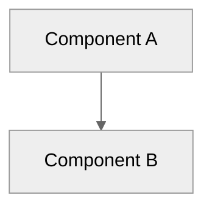

**Why**: The neutral theme with explicit background color ensures:
- Text renders on opaque backgrounds (readable in both light and dark modes)
- Diagram has a consistent light gray background that's not transparent
- Visual distinction from surrounding content

### Theme Configuration by Diagram Type

All diagram types must include the theme directive with background:

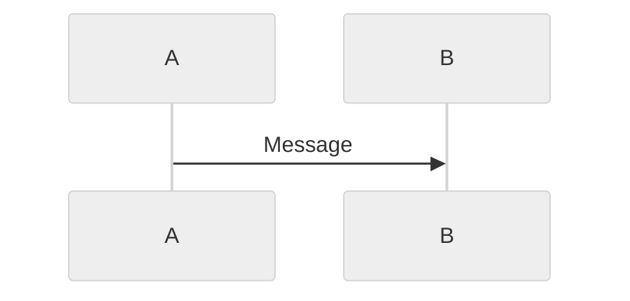

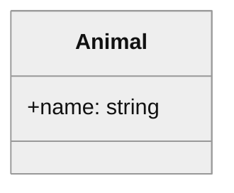

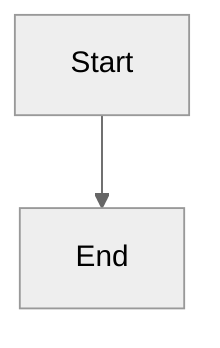

### Node Labels

**Format multi-line labels with `<br/>`**:
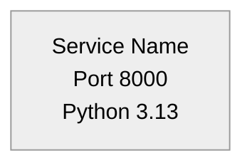

**Keep labels concise**:
- ✅ `FastAPI Backend<br/>Port 8000`
- ❌ `FastAPI Backend Service Running on Port 8000 with Python 3.13 and uvicorn ASGI server`

### Edge Labels

**Use clear, concise labels**:
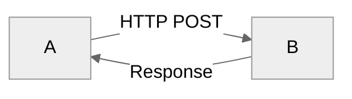

**Quote labels with special characters**:
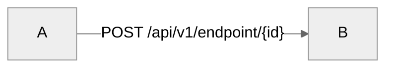

### Subgraphs

**Use descriptive titles**:
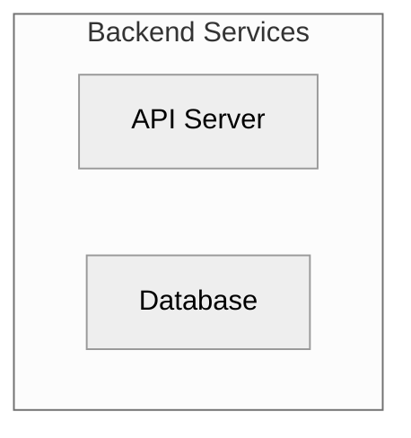

### Sequence Diagrams

**Use `autonumber` for clarity**:
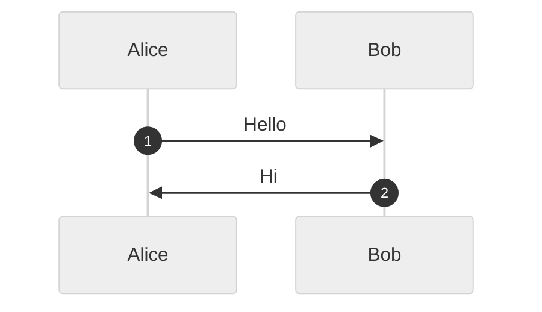

**Use descriptive participant aliases**:
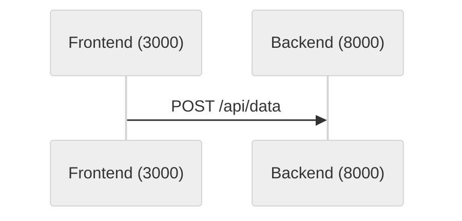

### Class Diagrams

**Show relevant properties and methods only**:
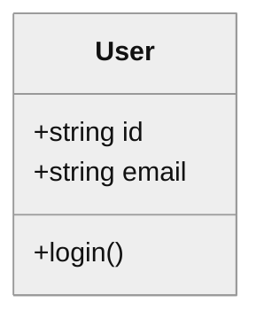

### Common Mermaid Mistakes

❌ **Missing theme configuration**:
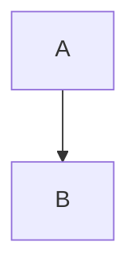

✅ **Correct**:
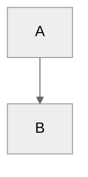

❌ **Quotes inside node labels**:
```mermaid
%%{init: {'theme':'neutral', 'themeVariables': {'background':'#f5f5f5'}}}%%
graph TB
    A[Type: "String"]
```

✅ **Correct**:
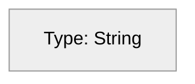

❌ **Unquoted edge labels with special chars**:
```mermaid
%%{init: {'theme':'neutral', 'themeVariables': {'background':'#f5f5f5'}}}%%
graph TB
    A -->|GET /api/{id}| B
```

✅ **Correct**:
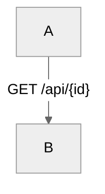

---

## Graphviz Diagrams

Graphviz diagrams are defined in `.dot` files and rendered separately using the `dot` command. **All text is rendered on opaque node/edge backgrounds**, ensuring readability.

### Required Configuration

**ALWAYS** include font settings and background color at the graph level:

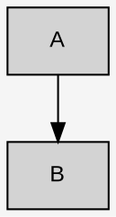

**Background color**: Use `bgcolor="#f5f5f5"` with `style=filled` in the `graph` attributes block for all diagrams. This ensures a non-transparent, opaque light gray background that provides consistent contrast with node colors and makes diagrams stand out from surrounding content.

### Font Size Standards

| Element | Font Size | Font Name |
|---------|-----------|-----------|
| **Graph/Cluster labels** | 14pt | Arial |
| **Node labels** | 12pt | Arial |
| **Edge labels** | 10pt | Arial |
| **Note boxes** | 11pt | Arial |

### Node Styling

**Default node configuration** (provides opaque background):
```dot
node [shape=box, style=filled, fontsize=12, fontname="Arial"];
```

**Common node shapes**:
- `shape=box` - Services, components
- `shape=cylinder` - Databases
- `shape=diamond` - Decisions
- `shape=note` - Annotations
- `shape=cloud` - External services
- `shape=component` - Containers

**Node with custom styling**:
```dot
database [label="PostgreSQL\nPort 5432",
          fillcolor=lightblue,
          shape=cylinder,
          fontsize=12];
```

**Note**: The `fillcolor` attribute ensures an opaque background, making text readable.

### Edge Styling

**Edge with label**:
```dot
A -> B [label="HTTP POST", fontsize=10];
```

**Bold edges for emphasis**:
```dot
A -> B [label="Direct Call\n(NOT HTTP)",
        style=bold,
        color=red,
        fontsize=10];
```

### Color Palette

Consistent colors across diagrams:

| Category | Fill Color | Use Case |
|----------|-----------|----------|
| **External/User** | `lightblue` | Users, external services |
| **Frontend** | `lightyellow` | UI, web apps |
| **Backend** | `lightgreen`, `palegreen` | APIs, services |
| **Processing** | `lightpink`, `pink` | Engines, processors |
| **Agent/AI** | `lightcyan`, `cyan` | Agents, AI components |
| **Database** | `skyblue` | Databases, storage |
| **Infrastructure** | `lightgray`, `gray` | Containers, networks |
| **Documentation** | `white` | Notes, legends |

### Subgraphs (Clusters)

**Cluster with label**:
```dot
subgraph cluster_backend {
    label="Backend Services (Port 8000)";
    fillcolor=lightgreen;
    style=filled;
    fontsize=14;

    API [label="API Server"];
    Service [label="Business Logic"];
}
```

### Multi-line Labels

**Use `\n` for line breaks**:
```dot
node [label="Service Name\nPort 8000\nPython 3.13"];
```

### Note Boxes

**Note boxes for documentation**:
```dot
note1 [label="Note:\n- Important detail 1\n- Important detail 2",
       fillcolor=white,
       shape=note,
       fontsize=11];
```

### Layout Control

**Direction**:
- `rankdir=TB` - Top to bottom (hierarchies)
- `rankdir=LR` - Left to right (flows)

---

## Testing Diagrams

### Testing Mermaid Diagrams

1. **GitHub Preview**: Push changes and verify rendering on GitHub in both light and dark modes
2. **Mermaid Live Editor**: Test at https://mermaid.live/
3. **Local Preview**:
   ```bash
   npm install -g @mermaid-js/mermaid-cli
   mmdc -i diagram.mmd -o output.png
   ```

### Testing Graphviz Diagrams

1. **Local Rendering**:
   ```bash
   dot -Tpng diagram.dot -o output.png
   dot -Tsvg diagram.dot -o output.svg
   ```

2. **Verify font rendering**: Open generated image and check text readability

---

## Automation Tools

### Mermaid Theme Updater

Ensure all Mermaid diagrams have theme configuration:

```bash
python3 scripts/fix_mermaid_dark_mode.py
```

### Graphviz Font Checker

Verify all `.dot` files have font configuration:

```bash
grep -L "fontsize" docs/DATAFLOW_*.dot
```

---

## Quick Reference

### Mermaid Template

```mermaid
%%{init: {'theme':'neutral', 'themeVariables': {'background':'#f5f5f5'}}}%%
graph TB
    subgraph "Layer Name"
        A[Component<br/>Port 8000]
        B[Component<br/>Details]
    end

    A -->|"Action/Protocol"| B
```

### Graphviz Template

```dot
// Diagram Title
digraph DiagramName {
    rankdir=TB;
    bgcolor="#f5f5f5";  // Light gray background

    // Font settings for readability
    graph [fontsize=14, fontname="Arial"];
    node [shape=box, style=filled, fontsize=12, fontname="Arial"];
    edge [fontsize=10, fontname="Arial"];

    // Nodes with opaque backgrounds
    service [label="Service Name\nPort 8000", fillcolor=lightgreen];
    database [label="Database", fillcolor=skyblue, shape=cylinder];

    // Edges
    service -> database [label="Query", fontsize=10];

    // Notes with opaque backgrounds
    note1 [label="Note:\n- Detail 1",
           fillcolor=white,
           shape=note,
           fontsize=11];
}
```

---

## Checklist for New Diagrams

### Mermaid Checklist
- [ ] Theme configuration with background present (`%%{init: {'theme':'neutral', 'themeVariables': {'background':'#f5f5f5'}}}%%`)
- [ ] Node labels are concise (use `<br/>` for multi-line)
- [ ] Edge labels with special characters are quoted
- [ ] Tested on GitHub (both light and dark modes)

### Graphviz Checklist
- [ ] Font configuration present (graph, node, edge)
- [ ] Font sizes follow standards (14pt/12pt/10pt/11pt)
- [ ] All nodes have `style=filled` for opaque backgrounds
- [ ] Colors follow standard palette
- [ ] Rendered locally with `dot` command
- [ ] Text is readable in generated image

---

## References

- [Mermaid Documentation](https://mermaid.js.org/)
- [Mermaid Theme Configuration](https://mermaid.js.org/config/theming.html)
- [Graphviz Documentation](https://graphviz.org/documentation/)
- [Graphviz Attributes Reference](https://graphviz.org/doc/info/attrs.html)

---

**Document Version**: 1.0
**Last Updated**: 2026-01-02

**Remember**: Always define opaque background colors for text readability!
