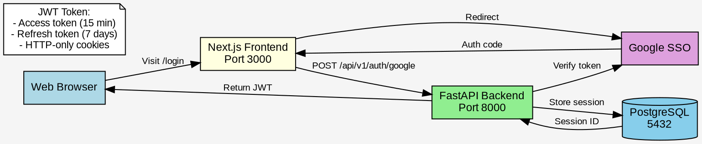

# Diagram Styling Guide

This document defines the **standard visual style** for all diagrams in MachinaMed documentation using **Graphviz .dot files rendered as SVG**. Following these guidelines ensures consistent, professional, and accessible diagrams across all documentation.

## Core Principles

1. **Use Graphviz .dot files with SVG output for ALL diagrams**
2. **Always define an opaque background color** (`bgcolor="#f5f5f5"` with `style=filled`)
3. **Maintain consistent entity definitions** across all diagrams
4. **Version control both source (.dot) and output (.svg) files**

---

## Why Graphviz + SVG?

✅ **Full styling control** - Complete control over colors, fonts, backgrounds, and layout
✅ **Consistent rendering** - SVG files render identically across all platforms and themes
✅ **Opaque backgrounds** - Guaranteed non-transparent light gray backgrounds
✅ **GitHub compatible** - SVG files display perfectly in GitHub markdown
✅ **Professional quality** - Publication-ready diagrams with precise control
✅ **Persistent entity identities** - Same entities look identical across all diagrams

---

## Quick Start Workflow

```bash
# 1. Create/edit diagram source
vim docs/DATAFLOW_my_feature.dot

# 2. Render to SVG
cd docs/
dot -Tsvg DATAFLOW_my_feature.dot -o DATAFLOW_my_feature.svg

# Or render all diagrams:
../scripts/render_diagrams.sh

# 3. Reference in markdown
echo "" >> DATAFLOW.md

# 4. Validate consistency
../scripts/validate_diagram_consistency.py

# 5. Commit both source and output
git add DATAFLOW_my_feature.dot DATAFLOW_my_feature.svg
git commit -m "docs: Add my feature dataflow diagram"
```

---

## Graphviz .dot File Structure

### Required Configuration

**ALWAYS** include this header in every `.dot` file:

```dot
// Diagram Title
// Brief description of what this diagram shows
digraph DiagramName {
    rankdir=TB;  // TB=top-to-bottom, LR=left-to-right

    // Font settings and background for readability
    graph [fontsize=14, fontname="Arial", bgcolor="#f5f5f5", style=filled];
    node [shape=box, style=filled, fontsize=12, fontname="Arial"];
    edge [fontsize=10, fontname="Arial"];

    // Diagram content here...
}
```

### Standard Entity Definitions

**CRITICAL**: Use these exact definitions for standard entities to ensure visual consistency across all diagrams.

```dot
// Core Services (always use these exact definitions)
FastAPI [label="FastAPI Backend\nPort 8000", fillcolor=lightgreen, shape=box];
NextJS [label="Next.js Frontend\nPort 3000", fillcolor=lightyellow, shape=box];
MedicalCatalog [label="Medical Catalog\nPort 8001", fillcolor=lightpink, shape=box];

// Databases (always cylinders with skyblue)
Postgres [label="PostgreSQL\n5432", fillcolor=skyblue, shape=cylinder];
Neo4j [label="Neo4j\n7474/7687", fillcolor=skyblue, shape=cylinder];
Redis [label="Redis\n6379", fillcolor=skyblue, shape=cylinder];
Qdrant [label="Qdrant\n6333", fillcolor=skyblue, shape=cylinder];

// External services and clients
Browser [label="Web Browser", fillcolor=lightblue, shape=box];
GeminiAPI [label="Google Gemini API", fillcolor=plum, shape=cloud];
GCP [label="Google Cloud Platform", fillcolor=plum, shape=cloud];

// Agent System
AgentSystem [label="Agent System\n23 agents", fillcolor=lightcyan, shape=box];
AgentTools [label="Agent Tools", fillcolor=cyan, shape=box];
```

**Reference**: See `docs/DATAFLOW_entities.dot` for the complete standard entity definitions.

### Font Size Standards

| Element | Font Size | Font Name |
|---------|-----------|-----------|
| **Graph/Cluster labels** | 14pt | Arial |
| **Node labels** | 12pt | Arial |
| **Edge labels** | 10pt | Arial |
| **Note boxes** | 11pt | Arial |

### Node Styling

**Default node configuration**:
```dot
node [shape=box, style=filled, fontsize=12, fontname="Arial"];
```

**Common node shapes**:
- `shape=box` - Services, components (default)
- `shape=cylinder` - Databases
- `shape=diamond` - Decision points
- `shape=note` - Annotations
- `shape=cloud` - External services
- `shape=component` - Containers

**Node with custom styling**:
```dot
MyService [label="Service Name\nPort 8000",
           fillcolor=lightgreen,
           shape=box];

Database [label="PostgreSQL\nPort 5432",
          fillcolor=skyblue,
          shape=cylinder];
```

### Edge Styling

**Edge with label**:
```dot
A -> B [label="HTTP POST"];
```

**Bold edges for emphasis**:
```dot
A -> B [label="Critical Path",
        style=bold,
        color=red];
```

**Dashed edges for optional/async**:
```dot
A -> B [label="Async",
        style=dashed];
```

### Color Palette

Consistent colors across all diagrams:

| Category | Fill Color | Use Case |
|----------|-----------|----------|
| **External/User** | `lightblue` | Browsers, external clients |
| **Frontend** | `lightyellow` | Next.js, UI components |
| **Backend** | `lightgreen`, `palegreen` | FastAPI, services |
| **Medical Catalog** | `lightpink`, `pink` | Catalog service |
| **Agent/AI** | `lightcyan`, `cyan` | Agent system, tools |
| **Database** | `skyblue` | PostgreSQL, Neo4j, Redis, Qdrant |
| **External Services** | `plum`, `lavender` | Google Cloud, Gemini API |
| **Infrastructure** | `lightgray`, `gray` | Containers, networks |
| **Documentation** | `white` | Notes, legends |

### Subgraphs (Clusters)

Use subgraphs to group related components:

```dot
subgraph cluster_backend {
    label="Backend Services (Port 8000)";
    fillcolor=lightgreen;
    style=filled;
    fontsize=14;

    FastAPI [label="FastAPI Server"];
    Services [label="Business Logic"];
}
```

### Multi-line Labels

Use `\n` for line breaks in labels:

```dot
MyNode [label="Service Name\nPort 8000\nPython 3.13"];
```

### Note Boxes

Add documentation notes to diagrams:

```dot
note1 [label="Note:\n- Important detail 1\n- Important detail 2\n- Important detail 3",
       fillcolor=white,
       shape=note,
       fontsize=11];
```

### Layout Control

**Direction**:
- `rankdir=TB` - Top to bottom (good for hierarchies)
- `rankdir=LR` - Left to right (good for flows)

**Ranking**:
```dot
// Force nodes to same rank (horizontal alignment)
{rank=same; NodeA; NodeB; NodeC}
```

---

## Maintaining Diagrams

### Regenerating SVG Files

**Single file**:
```bash
cd docs/
dot -Tsvg DATAFLOW_system_architecture.dot -o DATAFLOW_system_architecture.svg
```

**All files**:
```bash
./scripts/render_diagrams.sh
```

### Validating Consistency

Run the validation script to ensure all diagrams use consistent entity definitions:

```bash
./scripts/validate_diagram_consistency.py
```

This checks:
- Same entities look identical across all diagrams
- Colors, shapes, and labels are consistent
- No violations of standard entity definitions

### Workflow for Architecture Changes

When the system architecture changes:

1. **Identify affected diagrams**: Determine which diagrams need updates
2. **Update .dot files**: Edit the source `.dot` files
3. **Use standard entities**: Reference `DATAFLOW_entities.dot` for consistent definitions
4. **Validate consistency**: Run `./scripts/validate_diagram_consistency.py`
5. **Regenerate SVGs**: Run `./scripts/render_diagrams.sh`
6. **Test locally**: Open SVG files in browser to verify rendering
7. **Commit both**: Commit both `.dot` source and `.svg` output files
8. **Update markdown**: Update any markdown files that reference the diagrams

### Maintenance Scripts

| Script | Purpose |
|--------|---------|
| **`scripts/render_diagrams.sh`** | Regenerate all SVG files from .dot sources |
| **`scripts/validate_diagram_consistency.py`** | Check entity definitions are consistent |

---

## Complete Example

### Example .dot File



### Rendering

```bash
dot -Tsvg DATAFLOW_authentication.dot -o DATAFLOW_authentication.svg
```

### Markdown Reference

```markdown
## Authentication Flow


*Source: [DATAFLOW_authentication.dot](DATAFLOW_authentication.dot)*
```

---

## Checklist for New Diagrams

- [ ] Used standard Graphviz .dot format
- [ ] Included font configuration (14pt/12pt/10pt)
- [ ] Set `bgcolor="#f5f5f5"` with `style=filled`
- [ ] Used standard entity definitions from `DATAFLOW_entities.dot`
- [ ] All nodes have `style=filled` for opaque backgrounds
- [ ] Colors follow standard palette
- [ ] Validated with `./scripts/validate_diagram_consistency.py`
- [ ] Rendered successfully with `dot -Tsvg`
- [ ] Tested SVG display in browser
- [ ] Committed both .dot and .svg files
- [ ] Updated markdown references

---

## Troubleshooting

**Syntax errors when rendering**:
```bash
# Check for syntax errors
dot -Tsvg diagram.dot -o diagram.svg
# Graphviz will report line numbers of errors
```

**Entity inconsistencies**:
```bash
# Validate all diagrams
./scripts/validate_diagram_consistency.py
# Fix any reported issues
```

**SVG not displaying on GitHub**:
- Ensure the .svg file is committed to the repository
- Check the markdown reference uses correct relative path
- Verify the SVG file is not empty: `ls -lh diagram.svg`

---

## References

- [Graphviz Documentation](https://graphviz.org/documentation/)
- [Graphviz Attributes Reference](https://graphviz.org/doc/info/attrs.html)
- [Graphviz Node Shapes](https://graphviz.org/doc/info/shapes.html)
- [Graphviz Colors](https://graphviz.org/doc/info/colors.html)

---

**Document Version**: 2.0
**Last Updated**: 2026-01-05

**All diagrams use Graphviz + SVG with consistent entity definitions.**
