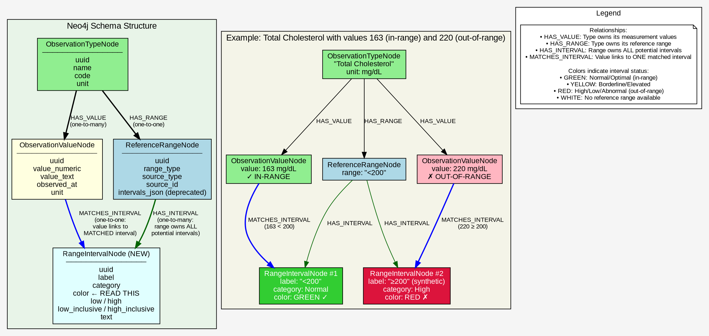

# Plan: Fix Biomarker Highlighting in UI

> **Note**: This plan will be moved to `docs/plans/BIOMARKER_HIGHLIGHTING.md` and linked from TODO.md

## Problem Summary

All 707 biomarkers display as "white" (uncategorized) instead of being color-coded red/yellow/green based on whether values are in-range or out-of-range.

## Root Cause Analysis

**Good News**: The interval matching logic already works correctly!
- `ObservationReferenceRange.classify_value()` computes interval matching ✅
- `ObservationValueResponse.from_node()` computes `matched_interval_label` and `matched_interval_category` ✅
- The router passes reference ranges to the computation ✅

**The Bugs**:

1. **BUG: Cypher queries read non-existent field**: Multiple Cypher queries try to read `v.document_value_color` from `ObservationValueNode`, but this property **does not exist in the schema**. This is a bug - the queries should not reference a non-existent field.

   Affected locations:
   - `observation.py:666` - `collect(v.document_value_color)[0..2] as top_statuses`
   - `observation.py:938` - `collect(v.document_value_color)[0..2] as statuses`

2. **Missing API response field**: Frontend expects `document_value_color` in the API response, but `ObservationValueResponse` doesn't include this field. The color should be **computed on-the-fly** from `matched_interval_category`, not stored in Neo4j.

**Where `document_value_color` is currently defined (incorrectly):**
- `observation.py:666,938` - Cypher queries read `v.document_value_color` from Neo4j (BUG - field doesn't exist)
- `router.py:95` - Query parameter for filtering (depends on buggy Cypher)
- `models.py:233` - `ObservationStatsResponse` (stats endpoint output)
- `session_context/models.py:189` - Medical agent DTO (reads from API)

**Where it should be defined (fix):**
- `models.py` - `ObservationValueResponse` class (computed from `matched_interval_category`)

## Data Flow Analysis

```
1. Reference Range Creation (parse_range_text)
   └── RangeInterval created with:
       ├── category: IntervalCategory (set or inferred from label) ✅
       └── color: IntervalColor | None = None  ← NOT SET

2. Storage in Neo4j
   └── reference_range.model_dump_json() → intervals_json

3. Retrieval (ObservationValueResponse.from_node)
   ├── reference_range.classify_value(value_numeric) → matched_interval_label
   ├── reference_range.get_interval(label) → interval
   └── interval.category → matched_interval_category ✅

4. NEW: Compute document_value_color
   └── _compute_color_from_category(matched_interval_category) → "green"/"yellow"/"red"/"white"
```

**Key insight**: `RangeInterval.color` field exists but is never populated. We compute color from `category` instead.

## Proposed Solution: Create RangeIntervalNode (Schema Change)

**Architecture Decision**: Create proper `RangeIntervalNode` entities in Neo4j to enable direct Cypher queries on interval properties.

**Schema Changes**:
```
KEEP:     (ObservationTypeNode)-[:HAS_RANGE]->(ReferenceRangeNode)     # Type owns its reference range
KEEP:     (ObservationTypeNode)-[:HAS_VALUE]->(ObservationValueNode)  # Type owns its values
NEW:      (ReferenceRangeNode)-[:HAS_INTERVAL]->(RangeIntervalNode)   # Range owns its intervals
NEW:      (ObservationValueNode)-[:MATCHES_INTERVAL]->(RangeIntervalNode)  # Value links to matched interval
DELETE:   (ObservationValueNode)-[:MEASURED_WITH_RANGE]->(ReferenceRangeNode)  # REDUNDANT - type already links to range
```

**Key relationships**:
- **HAS_INTERVAL**: A ReferenceRangeNode owns ALL its potential RangeIntervalNode entities (including synthetic)
- **MATCHES_INTERVAL**: An ObservationValueNode links to the ONE specific RangeIntervalNode that matches its value

**Match timing**: Computed when creating/updating values. When storing an observation value:
1. Get the reference range from the observation type (via HAS_RANGE)
2. Match the value against intervals to find the correct RangeIntervalNode
3. Create `[:MATCHES_INTERVAL]` relationship from value to matched interval
4. Read `color` directly from the matched interval node

**Synthetic intervals**: Stored at creation time. When creating reference range:
1. Create original interval(s) from document/catalog
2. Call `complete_intervals_coverage()` to add synthetic intervals for out-of-range coverage
3. Create `RangeIntervalNode` for ALL intervals (original + synthetic)
4. Link all to `ReferenceRangeNode` via `[:HAS_INTERVAL]`

This ensures every value matches exactly one interval in Neo4j.

### Neo4j Graph Diagram

**Graphviz source file**: `docs/plans/BIOMARKER_HIGHLIGHTING_SCHEMA.dot`



**Render the diagram:**
```bash
cd docs/plans/
dot -Tsvg BIOMARKER_HIGHLIGHTING_SCHEMA.dot -o BIOMARKER_HIGHLIGHTING_SCHEMA.svg
```

**Summary of relationships:**
- **Value 163 mg/dL** → `MATCHES_INTERVAL` → **Interval #1** ("<200", Normal, GREEN) ✓ in-range
- **Value 220 mg/dL** → `MATCHES_INTERVAL` → **Interval #2** ("≥200", High, RED) ✗ out-of-range

**Query to get document_value_color (simple traversal via MATCHES_INTERVAL):**
```cypher
MATCH (v:ObservationValueNode)-[:MATCHES_INTERVAL]->(i:RangeIntervalNode)
RETURN v.uuid, v.value_numeric, i.color as document_value_color
```

**Creating the MATCHES_INTERVAL relationship (when storing a value):**
```cypher
// Find the matching interval via the type's reference range
MATCH (t:ObservationTypeNode)-[:HAS_VALUE]->(v:ObservationValueNode {uuid: $value_uuid})
MATCH (t)-[:HAS_RANGE]->(rr:ReferenceRangeNode)-[:HAS_INTERVAL]->(i:RangeIntervalNode)
WHERE (i.low IS NULL OR toFloat(i.low) <= v.value_numeric)
  AND (i.high IS NULL OR v.value_numeric < toFloat(i.high))
  -- Note: simplified, actual query handles inclusive/exclusive bounds
CREATE (v)-[:MATCHES_INTERVAL]->(i)
```

**RangeIntervalNode properties**:
- `uuid`: unique identifier
- `label`: interval label (e.g., "Document Range", "Optimal")
- `category`: IntervalCategory enum value ("Normal", "High", "Low", etc.)
- `color`: IntervalColor enum value ("green", "yellow", "red")
- `low`: lower bound (string, nullable)
- `high`: upper bound (string, nullable)
- `low_inclusive`: boolean
- `high_inclusive`: boolean
- `text`: original text representation

**Benefits**:
- Cypher can directly query interval properties (category, color)
- Stats queries can aggregate by color in Cypher
- Proper Neo4j relationships vs JSON parsing
- Better for filtering/aggregation

**Migration**:
- Existing `intervals_json` data converted to `RangeIntervalNode` entities
- Keep `intervals_json` field for backward compatibility during transition

---

## Implementation Steps

### Step 1: Update Schema with New Nodes and Relationships

**File**: `repos/dem2/services/graph-memory/src/machina/graph_memory/medical/graph/schema.yml`

**Add new node type:**
```yaml
RangeIntervalNode:
  description: "Single interval within a reference range"
  properties:
    uuid: {type: string, required: true}
    created_at: {type: datetime, required: true}
    updated_at: {type: datetime, required: true}
    label: {type: string, required: true}
    category: {type: string, required: false}  # IntervalCategory enum value
    color: {type: string, required: false}      # IntervalColor enum value
    low: {type: string, required: false}
    high: {type: string, required: false}
    low_inclusive: {type: boolean, required: true}
    high_inclusive: {type: boolean, required: true}
    text: {type: string, required: true}
```

**Add new relationships:**
```yaml
HAS_INTERVAL:
  source: ReferenceRangeNode
  target: RangeIntervalNode
  properties: {}

MATCHES_INTERVAL:
  source: ObservationValueNode
  target: RangeIntervalNode
  properties: {}
```

**Delete redundant relationship:**
```yaml
# DELETE: MEASURED_WITH_RANGE (ObservationValueNode → ReferenceRangeNode)
# REASON: Redundant with ObservationTypeNode → HAS_RANGE → ReferenceRangeNode
# The reference range is already linked via the type, not directly from value
```

Run `just graph-generate` to regenerate node classes.

### Step 2: Create Migration for Existing Data

**File**: `repos/dem2/services/graph-memory/src/machina/graph_memory/medical/graph/migrations/`

Create migration script to:
1. Find all `ReferenceRangeNode` with `intervals_json`
2. Parse JSON and create `RangeIntervalNode` for each interval
3. Create `[:HAS_INTERVAL]` relationships
4. Compute and set `color` based on `category`
5. **Delete all existing `[:MEASURED_WITH_RANGE]` relationships**
6. **For each `ObservationValueNode`, create `[:MATCHES_INTERVAL]` to the correct interval:**
   ```cypher
   // For each value, find matching interval via type's reference range
   MATCH (t:ObservationTypeNode)-[:HAS_VALUE]->(v:ObservationValueNode)
   WHERE v.value_numeric IS NOT NULL
   MATCH (t)-[:HAS_RANGE]->(rr:ReferenceRangeNode)-[:HAS_INTERVAL]->(i:RangeIntervalNode)
   WHERE (i.low IS NULL OR toFloat(i.low) <= v.value_numeric)
     AND (i.high IS NULL OR v.value_numeric < toFloat(i.high))
   CREATE (v)-[:MATCHES_INTERVAL]->(i)
   ```

### Step 3: Update Reference Range Creation Code

**File**: `repos/dem2/services/graph-memory/src/machina/graph_memory/medical/graph/observation/observation.py`

Update `create_reference_range()` and batch methods to:
1. Create `RangeIntervalNode` entities for each interval
2. Set `color` using `compute_color_from_category()`
3. Create `[:HAS_INTERVAL]` relationships
4. **Remove any code that creates `[:MEASURED_WITH_RANGE]`**

### Step 3.5: Update Value Creation Code to Create MATCHES_INTERVAL

**File**: `repos/dem2/services/graph-memory/src/machina/graph_memory/medical/graph/observation/observation.py`

When creating `ObservationValueNode`:
1. After creating the value node, find the type's reference range
2. Match value against intervals to find the correct `RangeIntervalNode`
3. Create `[:MATCHES_INTERVAL]` relationship from value to matched interval
4. **Remove any code that creates `[:MEASURED_WITH_RANGE]`**

### Step 4: Remove `document_value_color` from ObservationValueNode Cypher Queries (Bug Fix)

**File**: `repos/dem2/services/graph-memory/src/machina/graph_memory/medical/graph/observation/observation.py`

Remove references to `v.document_value_color` from Cypher queries - this field doesn't exist in the schema.

**Locations to fix**:
- Line 666: `collect(v.document_value_color)[0..2] as top_statuses` → remove or replace
- Line 938: `collect(v.document_value_color)[0..2] as statuses` → remove or replace

The stats/filtering logic will be moved to Python (Step 3).

### Step 2: Add Helper Function for Color Computation

**File**: `repos/dem2/packages/medical-types/src/machina/medical_types/observation.py`

Add helper function to compute color from category (place near `IntervalColor` enum):

```python
def compute_color_from_category(category: IntervalCategory | None) -> IntervalColor | None:
    """Map interval category to display color."""
    if category is None:
        return None
    if category in [IntervalCategory.NORMAL, IntervalCategory.OPTIMAL, IntervalCategory.IDEAL]:
        return IntervalColor.GREEN
    if category in [IntervalCategory.BORDERLINE, IntervalCategory.ELEVATED]:
        return IntervalColor.YELLOW
    if category in [IntervalCategory.HIGH, IntervalCategory.LOW,
                    IntervalCategory.CRITICAL_HIGH, IntervalCategory.CRITICAL_LOW,
                    IntervalCategory.ABNORMAL]:
        return IntervalColor.RED
    return None
```

### Step 3: Update `complete_intervals_coverage()` to Set Categories for Synthetic Intervals

**File**: `repos/dem2/packages/medical-types/src/machina/medical_types/observation.py`

**Problem**: Synthetic intervals for out-of-range values have `category=None`, causing `document_value_color=None` for out-of-range values.

**Key Insight**: The synthetic interval's category depends on the adjacent original interval's category:
- If original is abnormal (HIGH/LOW), synthetic should be NORMAL (the complement)
- If original is NORMAL, synthetic should be abnormal (HIGH/LOW)

**Examples:**
1. Lab gives "HIGH: >200" → original=HIGH, synthetic below should be NORMAL
2. Lab gives "LOW: <10" → original=LOW, synthetic above should be NORMAL
3. Lab gives "Normal: 80-120" → synthetic below=LOW, synthetic above=HIGH

**Fix**: Update `complete_intervals_coverage()` to assign proper categories and colors:

```python
def _infer_synthetic_category(adjacent_category: IntervalCategory | None, position: str) -> tuple[IntervalCategory, IntervalColor]:
    """Infer category/color for synthetic interval based on adjacent interval.

    Args:
        adjacent_category: Category of the adjacent original interval
        position: "low" for synthetic at low end, "high" for synthetic at high end
    """
    # If adjacent is abnormal, synthetic is normal (complement)
    # If adjacent is normal, synthetic is abnormal
    abnormal_categories = {
        IntervalCategory.HIGH, IntervalCategory.LOW,
        IntervalCategory.CRITICAL_HIGH, IntervalCategory.CRITICAL_LOW,
        IntervalCategory.ABNORMAL, IntervalCategory.BORDERLINE, IntervalCategory.ELEVATED
    }
    normal_categories = {IntervalCategory.NORMAL, IntervalCategory.OPTIMAL, IntervalCategory.IDEAL}

    if adjacent_category in abnormal_categories:
        # Adjacent is abnormal → synthetic is normal
        return IntervalCategory.NORMAL, IntervalColor.GREEN
    elif adjacent_category in normal_categories:
        # Adjacent is normal → synthetic is abnormal
        if position == "low":
            return IntervalCategory.LOW, IntervalColor.RED
        else:
            return IntervalCategory.HIGH, IntervalColor.RED
    else:
        # Unknown/None category → default to abnormal
        if position == "low":
            return IntervalCategory.LOW, IntervalColor.RED
        else:
            return IntervalCategory.HIGH, IntervalColor.RED


def complete_intervals_coverage(intervals: list[RangeInterval]) -> list[RangeInterval]:
    # ... existing logic ...

    if first.low is not None:
        # Need synthetic interval for -∞ to first.low
        high_inclusive = not first.low_inclusive
        category, color = _infer_synthetic_category(first.category, "low")
        result.append(
            RangeInterval(
                label=f"< {first.low}",
                category=category,
                color=color,
                low=None,
                high=first.low,
                low_inclusive=True,
                high_inclusive=high_inclusive,
                text=f"< {first.low}",
            )
        )

    result.extend(sorted_intervals)

    if last.high is not None:
        # Need synthetic interval for last.high to +∞
        low_inclusive = not last.high_inclusive
        category, color = _infer_synthetic_category(last.category, "high")
        result.append(
            RangeInterval(
                label=f"> {last.high}",
                category=category,
                color=color,
                low=last.high,
                high=None,
                low_inclusive=low_inclusive,
                high_inclusive=True,
                text=f"> {last.high}",
            )
        )

    return result
```

**Test cases:**
1. Lab: "HIGH: >200" → synthetic `≤200` gets NORMAL/GREEN ✅
2. Lab: "LOW: <10" → synthetic `≥10` gets NORMAL/GREEN ✅
3. Lab: "Normal: 80-120" → synthetic `<80` gets LOW/RED, `>120` gets HIGH/RED ✅
4. Lab: "Normal: <200" (cholesterol) → synthetic `≥200` gets HIGH/RED ✅

**Note**: This affects the centralized `complete_intervals_coverage()` function, so all callers benefit.

### Step 4: Populate `RangeInterval.color` at Creation Time

**File**: `repos/dem2/services/medical-data-engine/src/machina/medical_data_engine/enricher/observation_enricher/utils.py`

Set color in `parse_range_text()` (uses helper from Step 2):

```python
from machina.medical_types.observation import compute_color_from_category

def parse_range_text(...) -> RangeInterval:
    # ... existing parsing logic ...

    # Infer category if not provided
    if category is None:
        category = infer_category_from_label(label)

    # NEW: Compute color from category
    color = compute_color_from_category(category)

    return RangeInterval(
        label=label,
        category=category,
        color=color,  # NEW: Set color here
        low=low,
        high=high,
        low_inclusive=low_inclusive,
        high_inclusive=high_inclusive,
        text=original_text,
    )
```

### Step 5: Add `matched_interval_color` to API Response Model

**File**: `repos/dem2/services/graph-memory/src/machina/graph_memory/medical/graph/observation/models.py`

Add `matched_interval_color` as a sibling field to `matched_interval_label` and `matched_interval_category`, following the same naming pattern:

```python
class ObservationValueResponse(BaseModel):
    uid: str
    value_numeric: float | None = None
    value_text: str | None = None
    observed_at: datetime
    created_at: datetime
    source_type: str
    source_id: str
    unit: str
    matched_interval_label: str | None = None      # Existing
    matched_interval_category: IntervalCategory | None = None  # Existing
    matched_interval_color: str | None = None      # NEW: sibling field

    @classmethod
    def from_node(cls, node, matched_interval=None):
        """
        Args:
            node: ObservationValueNode
            matched_interval: RangeIntervalNode from MATCHES_INTERVAL relationship (or None)
        """
        matched_interval_label = None
        matched_interval_category = None
        matched_interval_color = None

        if matched_interval is not None:
            matched_interval_label = matched_interval.label
            matched_interval_category = matched_interval.category
            matched_interval_color = matched_interval.color  # Direct read from graph!

        return cls(
            uid=node.uuid,
            # ... other fields ...
            matched_interval_label=matched_interval_label,
            matched_interval_category=matched_interval_category,
            matched_interval_color=matched_interval_color,
        )
```

**Naming convention**: `matched_interval_*` prefix matches the pattern of existing fields:
- `matched_interval_label` - the interval's label (e.g., "Document Range", "Normal")
- `matched_interval_category` - the interval's category (e.g., "Normal", "High")
- `matched_interval_color` - the interval's color (e.g., "green", "red", "yellow")

**Category to Color Mapping** (set at interval creation time):
- `green`: NORMAL, OPTIMAL, IDEAL
- `yellow`: BORDERLINE, ELEVATED
- `red`: HIGH, LOW, CRITICAL_HIGH, CRITICAL_LOW, ABNORMAL
- `white`: Unknown category or no reference range

### Step 6: Update Stats Endpoint to Use MATCHES_INTERVAL

**File**: `repos/dem2/services/graph-memory/src/machina/graph_memory/medical/graph/observation/observation.py`

The `get_patient_observation_stats()` method can now read colors directly from Neo4j via MATCHES_INTERVAL:

```cypher
// Get color counts directly from graph
MATCH (t:ObservationTypeNode)-[:HAS_VALUE]->(v:ObservationValueNode)
OPTIONAL MATCH (v)-[:MATCHES_INTERVAL]->(i:RangeIntervalNode)
RETURN
  count(CASE WHEN i.color = 'green' THEN 1 END) as green_count,
  count(CASE WHEN i.color = 'yellow' THEN 1 END) as yellow_count,
  count(CASE WHEN i.color = 'red' THEN 1 END) as red_count,
  count(CASE WHEN i.color IS NULL OR i IS NULL THEN 1 END) as white_count
```

**Benefits**: Color aggregation happens entirely in Neo4j, no Python computation needed.

### Step 7: Update Grouped Query to Use MATCHES_INTERVAL

**File**: `repos/dem2/services/graph-memory/src/machina/graph_memory/medical/graph/observation/observation.py`

The `get_patient_values_grouped_by_type()` method can now filter/include color via MATCHES_INTERVAL:

```cypher
MATCH (t:ObservationTypeNode)-[:HAS_VALUE]->(v:ObservationValueNode)
OPTIONAL MATCH (v)-[:MATCHES_INTERVAL]->(i:RangeIntervalNode)
// Filter by color if requested
WHERE $color IS NULL OR i.color = $color
RETURN t, v, i.color as matched_interval_color, i.label as matched_interval_label
```

**Benefits**: Color filtering happens in Cypher, no need to fetch all and filter in Python.

### Step 8: Update Frontend to Use `matched_interval_color`

**Goal**: Replace all `document_value_color` references with `matched_interval_color` in the frontend.

**Files to update in `repos/dem2-webui`**:

1. **`src/types/fhir-storage.ts`**:
   - Add `matched_interval_color` field to `ObservationValue` and `ObservationValueResponse`
   - Keep `document_value_color` as deprecated for backward compatibility
   ```typescript
   // In ObservationValue interface:
   matched_interval_label?: string | null;
   matched_interval_category?: IntervalCategory | null;
   matched_interval_color?: string | null;  // NEW: sibling field
   /** @deprecated Use matched_interval_color instead */
   document_value_color?: ValueStatus | null;
   ```

2. **`src/lib/observation-transformers.ts`**:
   - Update transformer to map `matched_interval_color`
   ```typescript
   export const transformObservationValueResponse = (...) => ({
     // ...
     matched_interval_color: item.matched_interval_color ?? null,  // NEW
     document_value_color: item.document_value_color ?? null,      // Keep for backward compat
   });
   ```

3. **`src/components/fhir-storage/cells/chip-value.tsx`**:
   - Use `matched_interval_color` instead of `document_value_color`
   ```typescript
   // Before:
   const valueColor = (observation_value.document_value_color ?? observation_value.value_status)?.toLowerCase()
   // After:
   const valueColor = (observation_value.matched_interval_color ?? observation_value.document_value_color ?? observation_value.value_status)?.toLowerCase()
   ```

4. **`src/components/fhir-storage/observation-history-chart.tsx`**:
   - Use `matched_interval_color` for chart point colors
   ```typescript
   // Before:
   const valueColor = obs.document_value_color ?? obs.value_status;
   // After:
   const valueColor = obs.matched_interval_color ?? obs.document_value_color ?? obs.value_status;
   ```

5. **`src/components/fhir-storage/observation-metric-modal.tsx`**:
   - Use `matched_interval_color` for value coloring in modal
   ```typescript
   // Before:
   const color = getValueStatusColor(value.document_value_color ?? value.value_status);
   // After:
   const color = getValueStatusColor(value.matched_interval_color ?? value.document_value_color ?? value.value_status);
   ```

6. **`src/components/fhir-storage/fhir-storage-view.tsx`**:
   - Update filter parameter name (if changing API)
   - Or keep `document_value_color` filter param for API compatibility

### Step 9: Regenerate Frontend Types

```bash
cd repos/dem2-webui && pnpm generate
```

This regenerates TypeScript types from the backend OpenAPI spec, picking up the new `matched_interval_color` field.

### Step 10: Verification

1. **API Response Test**:
   ```bash
   (cd repos/dem2 && just curl_api '{"function": "get_observations_grouped"}' | jq '.items[0].values[0] | {matched_interval_label, matched_interval_category, matched_interval_color}')
   ```
   Expected: All three `matched_interval_*` fields populated

2. **Stats Test**:
   ```bash
   (cd repos/dem2 && just curl_api '{"function": "get_observations_stats"}')
   ```
   Expected: Non-zero counts for green/yellow/red (not all white)

3. **UI Test**:
   - Navigate to http://localhost:3000/markers
   - Verify biomarkers show colored chips (green/yellow/red)
   - Verify out-of-range values (e.g., Folate 7.5 with >18.0 range) show as red

## Files to Modify

### Backend (repos/dem2)

1. `repos/dem2/services/graph-memory/src/machina/graph_memory/medical/graph/schema.yml`
   - Add `RangeIntervalNode` node type
   - Add `HAS_INTERVAL` relationship (ReferenceRangeNode → RangeIntervalNode)
   - Add `MATCHES_INTERVAL` relationship (ObservationValueNode → RangeIntervalNode)
   - **Delete `MEASURED_WITH_RANGE` relationship** (redundant)

2. `repos/dem2/services/graph-memory/src/machina/graph_memory/medical/graph/migrations/`
   - Create migration for existing intervals_json → RangeIntervalNode
   - Delete all existing `[:MEASURED_WITH_RANGE]` relationships
   - Create `[:MATCHES_INTERVAL]` relationships for all existing values

3. `repos/dem2/services/graph-memory/src/machina/graph_memory/medical/graph/observation/observation.py`
   - Remove `v.document_value_color` from Cypher queries (bug fix)
   - Update reference range creation to create RangeIntervalNode entities
   - Update value creation to create `[:MATCHES_INTERVAL]` relationship
   - Remove any code that creates `[:MEASURED_WITH_RANGE]`
   - Update stats query to use `[:MATCHES_INTERVAL]` traversal
   - Update grouped query to use `[:MATCHES_INTERVAL]` traversal, return `matched_interval_color`

4. `repos/dem2/packages/medical-types/src/machina/medical_types/observation.py`
   - Add `compute_color_from_category()` helper function
   - Update `complete_intervals_coverage()` to set category/color on synthetic intervals

5. `repos/dem2/services/medical-data-engine/src/machina/medical_data_engine/enricher/observation_enricher/utils.py`
   - Update `parse_range_text()` to set `RangeInterval.color`

6. `repos/dem2/services/graph-memory/src/machina/graph_memory/medical/graph/observation/models.py`
   - Add `matched_interval_color` field to `ObservationValueResponse` (sibling to `matched_interval_label` and `matched_interval_category`)
   - Update `from_node()` to accept matched_interval parameter
   - Read color directly from `RangeIntervalNode.color` via `[:MATCHES_INTERVAL]`

### Frontend (repos/dem2-webui)

7. `repos/dem2-webui/src/types/fhir-storage.ts`
   - Add `matched_interval_color` field to `ObservationValue` interface
   - Add `matched_interval_color` field to `ObservationValueResponse` interface
   - Mark `document_value_color` as deprecated

8. `repos/dem2-webui/src/lib/observation-transformers.ts`
   - Map `matched_interval_color` from API response to internal type

9. `repos/dem2-webui/src/components/fhir-storage/cells/chip-value.tsx`
   - Use `matched_interval_color` with fallback to `document_value_color`

10. `repos/dem2-webui/src/components/fhir-storage/observation-history-chart.tsx`
    - Use `matched_interval_color` for chart point colors

11. `repos/dem2-webui/src/components/fhir-storage/observation-metric-modal.tsx`
    - Use `matched_interval_color` for value coloring in modal

## Why This Approach?

**Pros**:
- Cypher can directly query interval properties (category, color)
- Stats queries can aggregate by color efficiently in Neo4j
- Proper graph model (nodes + relationships) vs JSON parsing
- Better for filtering/aggregation at scale
- Clean separation: interval data in graph, not embedded JSON

**Cons**:
- Requires schema migration
- More complex initial implementation
- Migration script needed for existing data

## Alternative Considered: JSON with Python Computation

Computing color on-the-fly in Python was considered but rejected because:
- Cannot efficiently query/filter by color in Cypher
- JSON parsing in Cypher is slower
- Duplicates interval matching logic if needed in both places
- Less maintainable as complexity grows

## Success Criteria

- [ ] API returns `matched_interval_color` field with correct values (alongside `matched_interval_label` and `matched_interval_category`)
- [ ] Stats endpoint returns accurate counts (not all white)
- [ ] UI displays colored chips for biomarkers using `matched_interval_color`
- [ ] Out-of-range values clearly highlighted in red
- [ ] In-range values shown in green
- [ ] Borderline values shown in yellow
- [ ] Frontend types regenerated with `pnpm generate`

## Implementation Order

### Backend (repos/dem2)

1. **Schema change** - Add `RangeIntervalNode`, `HAS_INTERVAL`, `MATCHES_INTERVAL` to schema.yml; delete `MEASURED_WITH_RANGE`
2. **Generate nodes** - Run `just graph-generate`
3. **Add helper function** - `compute_color_from_category()` in medical-types/observation.py
4. **Fix complete_intervals_coverage()** - Set category/color on synthetic intervals
5. **Populate at creation** - Update `parse_range_text()` to set `RangeInterval.color`
6. **Update range creation code** - Create `RangeIntervalNode` entities with `[:HAS_INTERVAL]`
7. **Update value creation code** - Create `[:MATCHES_INTERVAL]` relationship; remove `[:MEASURED_WITH_RANGE]` creation
8. **Create migration** - Migrate existing data:
   - Convert `intervals_json` to `RangeIntervalNode` entities
   - Delete all `[:MEASURED_WITH_RANGE]` relationships
   - Create `[:MATCHES_INTERVAL]` for all existing values
9. **Run migration** - Execute migration script
10. **Remove Cypher bug** - Delete `v.document_value_color` from Cypher queries
11. **Update stats query** - Use `[:MATCHES_INTERVAL]` traversal
12. **Update grouped query** - Use `[:MATCHES_INTERVAL]` traversal, return `matched_interval_color`
13. **Add API field** - Add `matched_interval_color` to `ObservationValueResponse` (sibling to `matched_interval_label` and `matched_interval_category`)
14. **Test API response** - Verify `matched_interval_color` populated via curl_api

### Frontend (repos/dem2-webui)

15. **Update types** - Add `matched_interval_color` to `fhir-storage.ts` types
16. **Update transformer** - Map `matched_interval_color` in `observation-transformers.ts`
17. **Update components** - Use `matched_interval_color` in chip-value.tsx, observation-history-chart.tsx, observation-metric-modal.tsx
18. **Regenerate types** - Run `pnpm generate` to get backend types

### Verification

19. **Test stats endpoint** - Verify non-zero color counts
20. **UI verification** - Browse /markers page, confirm colored chips

## Estimated Changes

### Backend (~300 lines)
- `schema.yml`: ~20 lines (new node + 2 relationships + delete 1)
- `medical_types/observation.py`: ~25 lines (add helper + update `complete_intervals_coverage()`)
- `utils.py`: ~5 lines (update `parse_range_text()` to set color)
- `observation.py`: ~150 lines (create nodes, MATCHES_INTERVAL, update queries, remove MEASURED_WITH_RANGE)
- `models.py`: ~20 lines (add field + matched_interval param)
- `migration script`: ~80 lines (migrate data + delete MEASURED_WITH_RANGE + create MATCHES_INTERVAL)

### Frontend (~50 lines)
- `fhir-storage.ts`: ~10 lines (add `matched_interval_color` field)
- `observation-transformers.ts`: ~5 lines (map new field)
- `chip-value.tsx`: ~5 lines (use new field with fallback)
- `observation-history-chart.tsx`: ~5 lines (use new field)
- `observation-metric-modal.tsx`: ~5 lines (use new field)
- Type regeneration: automatic via `pnpm generate`

**Total: ~350 lines of code**

## Rollback Plan

This approach includes a schema migration. Rollback requires:
1. Revert code changes
2. Re-create `MEASURED_WITH_RANGE` relationship definition in schema
3. Keep `RangeIntervalNode` data (orphaned but harmless)
4. Or run reverse migration to:
   - Re-create `[:MEASURED_WITH_RANGE]` relationships (if needed)
   - Delete `[:MATCHES_INTERVAL]` relationships
   - Delete `RangeIntervalNode` entities
